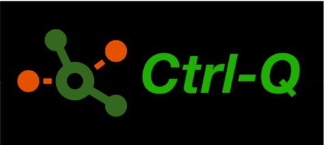

<h1 align="center">Ctrl-Q makes life easier for Qlik Sense admins and developers.  

It is a cross platform, command line tool for interacting with client-managed Qlik Sense Enterprise on Windows.</h2>

<h2 align="center">Ctrl-Q is designed to be easily extensible if/when additional features are needed. 
It is open source with a permissive MIT license. 
</h2>

 
 

Ctrl-Q has its own documentation site at [https://ctrl-q.ptarmiganlabs.com](https://ctrl-q.ptarmiganlabs.com).
