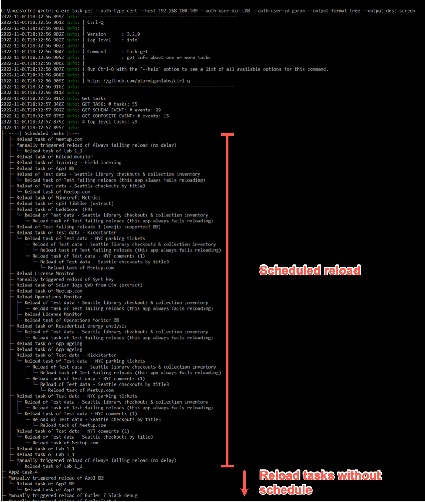
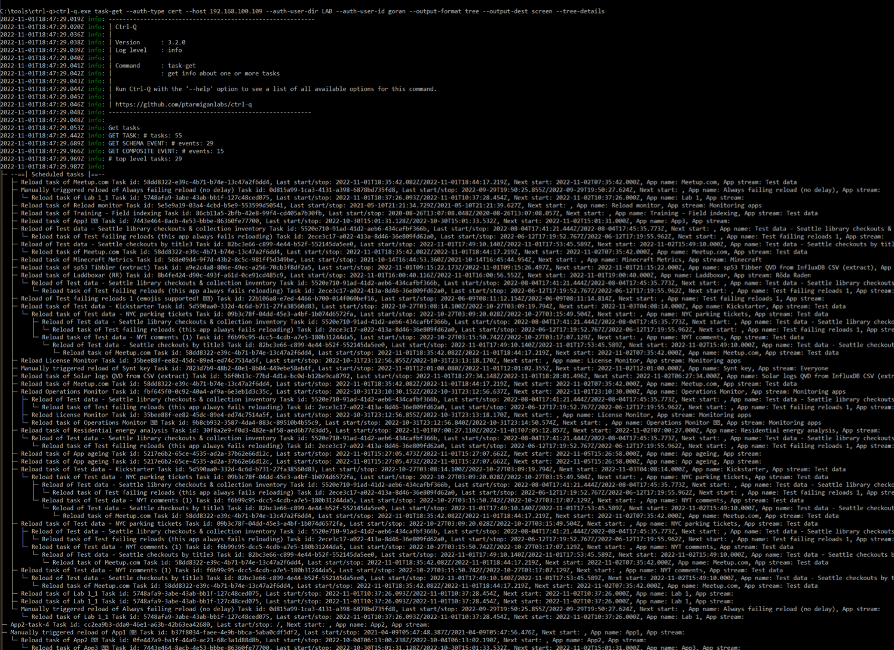
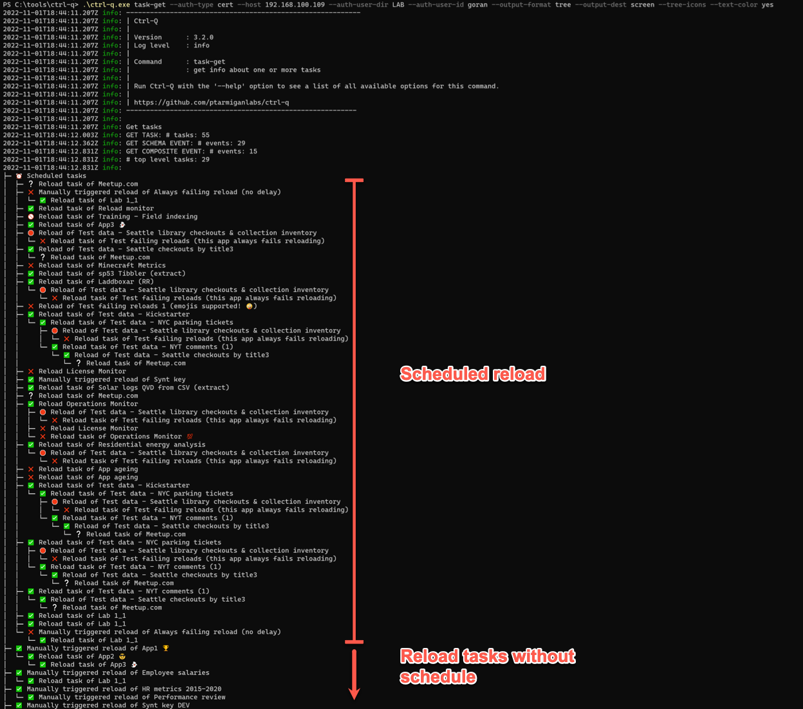
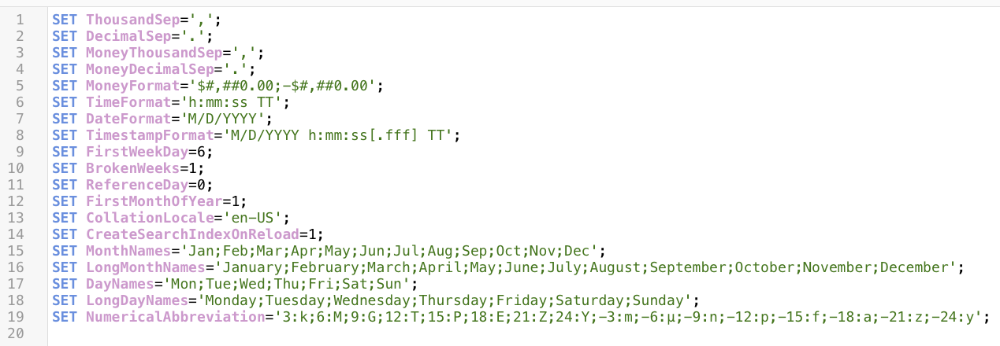
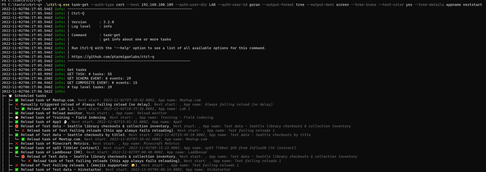
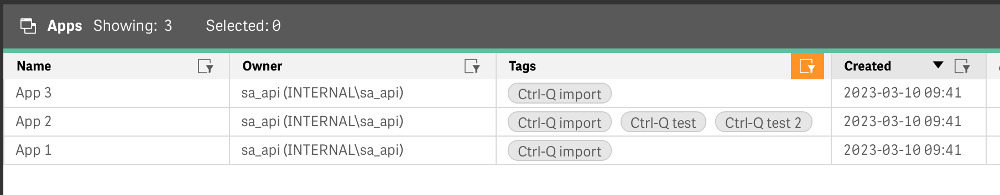
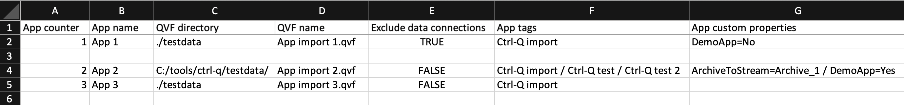
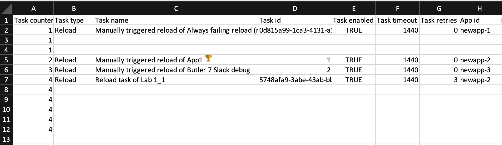

<p align="center"><p>

<h1 align="center">Ctrl-Q makes life easier for Qlik Sense admins and developers.<br><br>

It is a cross platform, command line tool for interacting with client-managed Qlik Sense Enterprise on Windows.</h2>

<p align="center">

</p>
<br>
<h2 align="center">Ctrl-Q is designed to be easily extensible if/when additional features are needed.<br>
It is open source with a permissive MIT license.<br>
</h2>
<p align="center">
<a href="https://github.com/ptarmiganlabs/ctrl-q"></a>
<a href="https://github.com/ptarmiganlabs/ctrl-q/actions/workflows/release-please.yml"></a>
<a href="https://www.repostatus.org/#active"></a>
<a href="https://github.com/ptarmiganlabs/ctrl-q/releases"></a>

</p>
<br>
<br>

The focus of Ctrl-Q is on slightly more complex use cases that are not handled out of the box by other tools such as [Qlik's official Qlik CLI tool](https://qlik.dev/libraries-and-tools/qlik-cli) or Adam Haydon's [Qlik CLI Windows](https://github.com/ahaydon/Qlik-Cli-Windows) tool.  
Both are exceptional tools and extremely useful, but especially when it comes to interactions with the Qlik Sense engine they fall a bit short.

Ctrl-Q also tries to fill niches that are not covered by the various members of the Butler family of open source SenseOps tools.

The Butler tools each focus on a specific feature (or features in the case of [the original Butler tool](https://github.com/ptarmiganlabs/butler)) and goes fairly deep in those areas.  
For example, [Butler SOS](https://github.com/ptarmiganlabs/butler-sos) focus on getting real-time metrics and events out of Sense and into a wide range of target databases and monitoring tools.  
[Butler Sheet Icons](https://github.com/ptarmiganlabs/butler-sheet-icons) creates sheet thumbnails for Sense apps - but offers lots of flexibility and power around that use case.

Ctrl-Q instead focus on specific, high-value uses cases that tend to be very time consuming and/or error prone to do manually.  

The current list of features are:

- Get complete definition of all reload tasks and external program tasks as tree view, tabular view or JSON. Show on screen or save to disk file.
- Bulk import of reload tasks from disk files. Optionally also import QVF files.<br>
  Building task chains with new and/or existing tasks supported. <br>
  All options available in the QMC (and then some!) can be defined.
- Bulk import of QVF files into Sense apps.
- Update custom properties for multiple tasks.
- Import master dimensions and master measures from definitions in Excel file, including per dimension/measure colors.
- Show complete definitions for all master measures in a Sense app.
- Delete master measures from a Sense app.
- Show complete definitions for all master dimensions in a Sense app.
- Delete variables in one or more apps.
- List complete defintions for all variables in one or more apps.
- Delete master dimensions from a Sense app.
- Show complete definition of all bookmarks in a Sense app.
- Scramble fields in Sense apps.
- Get load script from Sense app.

As Ctrl-Q is completely command line driven it is very suitable to be used in CI/CD pipelines, with time savings, increased reusability and higher app quality as a result.

Maybe Qlik's CLI tool will evolve to include more of these use cases and engine-focused features too - great if so.  
Until then Ctrl-Q can hopefully make life a bit easier for Sense developers and admins out there.

Finally, there are several blog posts on [ptarmiganlabs.com](https://ptarmiganlabs.com) where various Ctrl-Q features are examined in detail.  
Everything from short overviews of new features to very thorough, step-by-step instructions for how to use Ctrl-Q to solve some challenging Qlik Sense related task.

Enjoy!

# Contents

- [Contents](#contents)
- [Getting started](#getting-started)
- [Logging](#logging)
- [Security](#security)
  - [Virus scanning](#virus-scanning)
    - [Positive scan vs false positives](#positive-scan-vs-false-positives)
  - [Signed binaries](#signed-binaries)
- [Authenticating with Qlik Sense](#authenticating-with-qlik-sense)
  - [Certificates](#certificates)
- [Colors \& formatting: Windows vs Windows Server vs macOS/Linux](#colors--formatting-windows-vs-windows-server-vs-macoslinux)
  - [All OSs: plain text](#all-oss-plain-text)
  - [Windows 10 using Windows Terminal](#windows-10-using-windows-terminal)
  - [macOS and Linux](#macos-and-linux)
- [Dry runs are a good idea](#dry-runs-are-a-good-idea)
- [Commands](#commands)
  - [Bookmarks](#bookmarks)
    - [List bookmarks](#list-bookmarks)
  - [Measures](#measures)
    - [List measures](#list-measures)
    - [Delete measures](#delete-measures)
  - [Dimensions](#dimensions)
    - [List dimensions](#list-dimensions)
    - [Delete dimensions](#delete-dimensions)
  - [Variables](#variables)
    - [List variables](#list-variables)
    - [Delete variables](#delete-variables)
  - [Tasks](#tasks)
    - [List tasks as tree](#list-tasks-as-tree)
      - [Tree icons](#tree-icons)
      - [Text color](#text-color)
      - [Task tree details](#task-tree-details)
      - [Save tree to disk file](#save-tree-to-disk-file)
    - [List tasks as table](#list-tasks-as-table)
      - [Show task table on screen](#show-task-table-on-screen)
      - [Save task to disk file in tabular format](#save-task-to-disk-file-in-tabular-format)
      - [Save task to disk file as JSON](#save-task-to-disk-file-as-json)
  - [Custom properties](#custom-properties)
    - [Set custom property of reload task](#set-custom-property-of-reload-task)
  - [Export](#export)
    - [Export apps to QVF files](#export-apps-to-qvf-files)
  - [Import](#import)
    - [Import master items from Excel file](#import-master-items-from-excel-file)
    - [Import apps from QVF files](#import-apps-from-qvf-files)
    - [Import reload tasks from file](#import-reload-tasks-from-file)
      - [Source file columns for task defintions](#source-file-columns-for-task-defintions)
      - [Source file columns for app import definitions](#source-file-columns-for-app-import-definitions)
      - [Example: Export tasks to CSV, then import tasks from same CSV](#example-export-tasks-to-csv-then-import-tasks-from-same-csv)
      - [Example: Import apps from QVF files and create associated reload tasks](#example-import-apps-from-qvf-files-and-create-associated-reload-tasks)
        - [Defining tasks to be created](#defining-tasks-to-be-created)
        - [Associating new tasks with imported and existing apps](#associating-new-tasks-with-imported-and-existing-apps)
  - [Scramble fields in Sense app](#scramble-fields-in-sense-app)
  - [Get script](#get-script)

# Getting started

There is no need to install Ctrl-Q. Just download and run.  
The GitHub [release page](https://github.com/ptarmiganlabs/ctrl-q/releases) has ready-to-run binaries for Windows, macOS and Linux.

The macOS binary is security scanned and signed by Apple, using their standard notarization process.  
This means you won't get those annoying unsigned-app-warnings when using the app on macOS.

The Windows binary is signed by an official/commercial app signing certificate that can be verified when needed.

# Logging

Logging is controlled by the --log-level option.

Valid values are (in order of increasing verbosity): error, warn, info, verbose, debug, silly.

Note: When using log level silly all websocket communication to/from the Sense server will be logged to the console. This means *lots* of log output.

# Security

Ctrl-Q is open source and you have access to all source code.

It is ***your responsibility*** to determine if Ctrl-Q is suitable for **your** use case.  
The creators of Ctrl-Q, including Ptarmigan Labs, Göran Sander or any other contributor, can and must never be held liable to past or future security issues of Ctrl-Q.
If you have security concerns or ideas around Ctrl-Q, please get involved in the project and contribute to making it better!

    If you discover a serious bug with Ctrl-Q that may pose a security problem, please disclose it  
    confidentially to security@ptarmiganlabs.com first, so it can be assessed and hopefully fixed  
    prior to being exploited.  
    
    Please do not raise GitHub issues for serious security-related doubts or problems.

## Virus scanning

Every time a Ctrl-Q release is done the created binaries are sent to [VirusTotal](https://www.virustotal.com/) for scanning.  
VirusTotal acts as an aggregated virus scanner that sends the Ctrl-Q binaries to dozens of anti-virus scanners, including many of the major/most widely used ones.  

Links to the VirusTotal scan report are included in each release notes, making it easy to check the status of each binary:


A VirusTotal scan that reports "no risks found" can look like this:


### Positive scan vs false positives

If one or more of the security vendors used by VirusTotal reports an issue you have to make a decision.  
Is it a real issue or a false positive?

You have to decide this yourself, but some general lines of thought can be:

    Is it a single vendor that reports the Ctrl-Q binary file to be a risk, or several vendors?
    If one vendor reports an issue and 60+ vendors don't, you might be looking at a false positive.

But again - at the end of the day it's **you** that must make that decision.

A scan where a single security vendor reports an issue can look like this:


## Signed binaries

The macOS executable binary is signed and notarized by Apple's standard process.  
A warning may still be shown first time the app is started. This is expected and normal.

The Windows executable binary is signed by "Ptarmigan Labs AB".

# Authenticating with Qlik Sense

## Certificates

Ctrl-Q will authenticate with Sense using certificates.  
These certificates are [exported from the QMC](https://help.qlik.com/en-US/sense-admin/May2023/Subsystems/DeployAdministerQSE/Content/Sense_DeployAdminister/QSEoW/Administer_QSEoW/Managing_QSEoW/export-certificates.htm) and stored on disk in PEM format.

Ctrl-Q can reference these certificates in two ways:

1. if the `--auth-cert-file` and `auth-cert-key-file` options are used, Ctrl-Q will read the certificates from the disk files pointed to by those options. 
   1. The `--auth-root-cert-file` option refers to the certificate CA, and is optional to use. In most cases it's not needed.
2. If the options above are *not* specified when Ctrl-Q is started, it will look for certificates in the `config` folder in the same folder as the Ctrl-Q executable. The certificate files must be named `client.pem`, `client_key.pem` and `root.pem`.

The options `--auth-user-dir` and `-auth-user-id` are also needed to authenticate with Sense. They define which user will be used when interacting with both the engine and repository APIs.

# Colors & formatting: Windows vs Windows Server vs macOS/Linux

Some of the Ctrl-Q commands use colors and emojis to better communicate the information retrieved from Qlik Sense.  
The task tree view is an example, but more commands may use colors in the future.

The use of colors in console/command line applications has been around since at least the 80s.  
MS-DOS supported it, as did early Windows versions.

Today this feature is quite fragmented.

Console applications using colors are natively supported on macOS and Linux.  
On Windows Server 2016 and earlier it's *very* hard to get this working, later versions may be easier.  
On Windows 10 and later it's possible to use Microsoft's excellent new command line shell, [Windows Terminal](https://github.com/microsoft/terminal).  
Highly recommended if you use a desktop Windows operating system!

Ctrl-Q tries to offer plain text visuals unless extra features, flare and color is enabled via command line parameters.

Some examples follow, showing different views of reload task trees.

## All OSs: plain text

The command for the most basic task tree is

```
.\ctrl-q.exe task-get `
--auth-type cert `
--host 192.168.100.109 `
--auth-user-dir LAB `
--auth-user-id goran `
--output-format tree `
--output-dest screen
```



Add the `--tree-details` option and the result contains a lot more details for each task. Not very easy to read though.  
Note: the `task-get` command has lots of options, these are described in more detail in [List tasks as tree](#list-tasks-as-tree) section below.

```
.\ctrl-q.exe task-get `
--auth-type cert `
--host 192.168.100.109 `
--auth-user-dir LAB `
--auth-user-id goran `
--output-format tree `
--output-dest screen `
--tree-details
```



## Windows 10 using Windows Terminal

Thanks to Windows Terminal handling text coloring and emojis we can add a couple of options:

- `--tree-icons` to get emojis showing the result from each task's last execution (success, fail etc)
- `--text-color yes` to get nicely colored text in the task tree

```
.\ctrl-q.exe task-get `
--auth-type cert `
--host 192.168.100.109 `
--auth-user-dir LAB `
--auth-user-id goran `
--output-format tree `
--output-dest screen `
--tree-icons `
--text-color yes
```



Adding `--tree-details` gives us a tree that's a lot easier to read compared to previous, uncolored version.

```
.\ctrl-q.exe task-get `
--auth-type cert `
--host 192.168.100.109 `
--auth-user-dir LAB `
--auth-user-id goran `
--output-format tree `
--output-dest screen `
--tree-icons `
--text-color yes `
--tree-details
```


## macOS and Linux

A task tree with colors on macOS and Linux versions of Ctrl-Q looks exactly like same as in Windows Terminal.  
The only difference is that you don't have to install a new command line shell.

# Dry runs are a good idea

Many of Ctrl-Q's commands will create, update or delete things in Sense.  
As long as you have specified the correct parameters that's all good - but there is also the risk of using incorrect parameters or filters, causing too many (or too few or the wrong ones) resources in Sense to be affected.

Most Ctrl-Q commands that change things in Sense have a `--dry-run` option.  
If it is used, Ctrl-Q will not make any changes in Sense, but instead only show what *would* happen.

It's thus a *very* good idea to first do a dry run of the intended command, verify that the correct things would happen and then finally do a real execution of the desired Ctrl-Q command.

Might take a bit of extra time, but better safe than sorry.

# Commands

List available commands, using Windows Terminal/PowerShell:

```
.\ctrl-q.exe help
```

```
Usage: index [options] [command]

Ctrl-Q is a command line utility for interacting with client-managed Qlik Sense Enterprise on Windows servers.
Among other things the tool does bulk import of apps and tasks, manipulates master items and scrambles in-app data.

Options:
  -V, --version                         output the version number
  -h, --help                            display help for command

Commands:
  master-item-import [options]          create master items based on definitions in a file on disk
  master-item-measure-get [options]     get info about one or more master measures
  master-item-measure-delete [options]  delete master measure(s)
  master-item-dim-get [options]         get info about one or more master dimensions
  master-item-dim-delete [options]      delete master dimension(s)
  variable-get [options]                get variable definitions in one or more apps
  variable-delete [options]             delete one or more variables in one or more apps
  field-scramble [options]              scramble one or more fields in an app. A new app with the scrambled data is created.
  script-get [options]                  get script from Qlik Sense app
  bookmark-get [options]                get info about one or more bookmarks
  task-get [options]                    get info about one or more tasks
  task-custom-property-set [options]    update a custom property of one or more tasks
  task-import [options]                 create tasks based on definitions in a file on disk, optionally also importing apps from QVF files.
  app-import [options]                  import apps/upload QVF files on disk to Sense based on definitions in Excel file.
  app-export [options]                  export Qlik Sense apps to QVF files on disk.
  help [command]                        display help for command
```

**Note**: All examples below are using PowerShell.  
Adapt as needed for macOS, Linux and NodeJS.

## Bookmarks

### List bookmarks

```
.\ctrl-q.exe bookmark-get `
--host 192.168.100.109 `
--app-id a3e0f5d2-000a-464f-998d-33d333b175d7 `
--output-format table `
--auth-user-dir LAB `
--auth-user-id goran
```

```
2023-05-09T20:09:01.861Z info: -----------------------------------------------------------
2023-05-09T20:09:01.861Z info: | Ctrl-Q
2023-05-09T20:09:01.861Z info: |
2023-05-09T20:09:01.861Z info: | Version      : 3.9.0
2023-05-09T20:09:01.861Z info: | Log level    : info
2023-05-09T20:09:01.861Z info: |
2023-05-09T20:09:01.861Z info: | Command      : bookmark-get
2023-05-09T20:09:01.861Z info: |              : get info about one or more bookmarks
2023-05-09T20:09:01.861Z info: |
2023-05-09T20:09:01.877Z info: | Run Ctrl-Q with the '--help' option to see a list of all available options for this command.
2023-05-09T20:09:01.877Z info: |
2023-05-09T20:09:01.877Z info: | https://github.com/ptarmiganlabs/ctrl-q
2023-05-09T20:09:01.877Z info: ----------------------------------------------------------
2023-05-09T20:09:01.877Z info:
2023-05-09T20:09:01.877Z info: Get bookmarks
2023-05-09T20:09:02.392Z info: Bookmarks
┌──────────────────────────────────────────────────────────────────────────────────────────────────────────────────────────────────────────────────────────────────────────────────────────────────────────────────────────────────────────────────────────────────────────────────────────────────────────┐
│ Bookmarks (1 bookmark(s) found in the app)                                                                                                                                                                                                                                                               │
├──────────────────────────────────────┬──────────┬───────────┬─────────────────┬──────────────────────────────────────────────────────────────────────────────────────────────────────┬──────────┬───────────┬──────────────────────────┬──────────────────────────┬──────────────────────────┬───────────┤
│ Id                                   │ Type     │ Title     │ Description     │ Bookmark definition                                                                                  │ Approved │ Published │ Publish time             │ Created date             │ Modified date            │ Owner     │
├──────────────────────────────────────┼──────────┼───────────┼─────────────────┼──────────────────────────────────────────────────────────────────────────────────────────────────────┼──────────┼───────────┼──────────────────────────┼──────────────────────────┼──────────────────────────┼───────────┤
│ 81ec0c0d-c90c-431b-8c19-eff4048de404 │ bookmark │ Bookmark1 │ BM1 description │ {"qStateData":[{"qStateName":"$","qFieldItems":[{"qDef":{"qName":"Dim1","qType":"PRESENT"},"qSelectI │ false    │ false     │ 1753-01-01T00:00:00.000Z │ 2021-07-06T15:09:38.565Z │ 2021-07-06T15:09:38.565Z │ LAB\goran │
│                                      │          │           │                 │ nfo":{"qRangeLo":"NaN","qRangeHi":"NaN","qNumberFormat":{"qType":"U","qnDec":10,"qUseThou":0},"qRang │          │           │                          │                          │                          │           │
│                                      │          │           │                 │ eInfo":[],"qContinuousRangeInfo":[]},"qValues":[],"qExcludedValues":[]}]}],"qUtcModifyTime":44383.71 │          │           │                          │                          │                          │           │
│                                      │          │           │                 │ 498842593,"qVariableItems":[],"qPatches":[]}                                                         │          │           │                          │                          │                          │           │
└──────────────────────────────────────┴──────────┴───────────┴─────────────────┴──────────────────────────────────────────────────────────────────────────────────────────────────────┴──────────┴───────────┴──────────────────────────┴──────────────────────────┴──────────────────────────┴───────────┘
```

## Measures

### List measures

```
.\ctrl-q.exe master-item-measure-get `
--host 192.168.100.109 `
--auth-user-dir LAB `
--auth-user-id goran `
--app-id a3e0f5d2-000a-464f-998d-33d333b175d7 `
--output-format table
```

```
2023-05-09T18:40:23.517Z info: -----------------------------------------------------------
2023-05-09T18:40:23.517Z info: | Ctrl-Q
2023-05-09T18:40:23.517Z info: |
2023-05-09T18:40:23.517Z info: | Version      : 3.9.0
2023-05-09T18:40:23.517Z info: | Log level    : info
2023-05-09T18:40:23.517Z info: |
2023-05-09T18:40:23.517Z info: | Command      : master-item-measure-get
2023-05-09T18:40:23.517Z info: |              : get info about one or more master measures
2023-05-09T18:40:23.517Z info: |
2023-05-09T18:40:23.517Z info: | Run Ctrl-Q with the '--help' option to see a list of all available options for this command.
2023-05-09T18:40:23.517Z info: |
2023-05-09T18:40:23.517Z info: | https://github.com/ptarmiganlabs/ctrl-q
2023-05-09T18:40:23.517Z info: ----------------------------------------------------------
2023-05-09T18:40:23.517Z info:
2023-05-09T18:40:23.532Z info: Get master measures
2023-05-09T18:40:23.923Z info:
┌────────────────────────────────────────────────────────────────────────────────────────────────────────────────────────────────────────────────────────────────────────────────────────────────────────────────────────────────────────────────────────────────────────────────────────────────────────────────────────────────────────────────────────────────────────────────────────────────────────────────────────────────────────────────────────────────────────────────────┐
│ Measures (6 measure(s) found in the app)                                                                                                                                                                                                                                                                                                                                                                                                                                           │
├──────────────────────────────────────┬─────────┬────────────────────────┬───────────────────────────────────────────────────┬──────────────────┬──────────────────┬──────────────────────┬──────────────────────────────────────────────────────────────────────────────────────────────────────┬───────────────────────────────────────┬──────────┬──────────┬───────────┬──────────────────────────┬──────────────────────────┬──────────────────────────┬───────────┬───────────┤
│ Id                                   │ Type    │ Title                  │ Description                                       │ Label            │ Label expression │ Definition           │ Coloring                                                                                             │ Number format                         │ Grouping │ Approved │ Published │ Publish time             │ Created date             │ Modified date            │ Owner     │ Tags      │
├──────────────────────────────────────┼─────────┼────────────────────────┼───────────────────────────────────────────────────┼──────────────────┼──────────────────┼──────────────────────┼──────────────────────────────────────────────────────────────────────────────────────────────────────┼───────────────────────────────────────┼──────────┼──────────┼───────────┼──────────────────────────┼──────────────────────────┼──────────────────────────┼───────────┼───────────┤
│ 22ad7b77-21ad-4e0a-bc1a-dd8e3bd9a68f │ measure │ Revenue EUR            │ Revenue during selected time period.              │ ='Revenue'       │ ='Revenue'       │ Sum(Revenue)         │ Segment colors:                                                                                      │ {"qType":"U","qnDec":10,"qUseThou":0} │ N        │ false    │ false     │ 1753-01-01T00:00:00.000Z │ 2023-05-09T15:18:20.753Z │ 2023-05-09T15:44:15.756Z │ LAB\goran │ Sales     │
│                                      │         │                        │                                                   │                  │                  │                      │ {"colors":[{"color":"#006580","index":6},{"color":"#ac4d58","index":10},{"color":"#4477aa","index":- │                                       │          │          │           │                          │                          │                          │           │           │
│                                      │         │                        │                                                   │                  │                  │                      │ 1},{"color":"#7db8da","index":-1}],"breakTypes":[true,true,false],"limits":[0.223,0.491,0.728],"limi │                                       │          │          │           │                          │                          │                          │           │           │
│                                      │         │                        │                                                   │                  │                  │                      │ tType":"percent"}                                                                                    │                                       │          │          │           │                          │                          │                          │           │           │
├──────────────────────────────────────┼─────────┼────────────────────────┼───────────────────────────────────────────────────┼──────────────────┼──────────────────┼──────────────────────┼──────────────────────────────────────────────────────────────────────────────────────────────────────┼───────────────────────────────────────┼──────────┼──────────┼───────────┼──────────────────────────┼──────────────────────────┼──────────────────────────┼───────────┼───────────┤
│ 9d563fc2-ad00-41db-ad15-0f80c522686d │ measure │ Revenue EUR (LY)       │ Revenue during last year.                         │ ='Revenue LY'    │ ='Revenue LY'    │ Sum(Revenue_LY)      │                                                                                                      │ {"qType":"U","qnDec":10,"qUseThou":0} │ N        │ false    │ false     │ 1753-01-01T00:00:00.000Z │ 2023-05-09T15:18:20.753Z │ 2023-05-09T15:40:12.804Z │ LAB\goran │ Sales, LY │
├──────────────────────────────────────┼─────────┼────────────────────────┼───────────────────────────────────────────────────┼──────────────────┼──────────────────┼──────────────────────┼──────────────────────────────────────────────────────────────────────────────────────────────────────┼───────────────────────────────────────┼──────────┼──────────┼───────────┼──────────────────────────┼──────────────────────────┼──────────────────────────┼───────────┼───────────┤
│ a260c5a2-21e9-4ce5-92d9-c3e7837e51a2 │ measure │ No. of sold units (LY) │ Number of units sold last year.                   │ ='Sold units LY' │ ='Sold units LY' │ Sum(UnitsInOrder_LY) │ Measure color:                                                                                       │ {"qType":"U","qnDec":10,"qUseThou":0} │ N        │ false    │ false     │ 1753-01-01T00:00:00.000Z │ 2023-05-09T15:18:20.753Z │ 2023-05-09T15:40:12.804Z │ LAB\goran │ Sales, LY │
│                                      │         │                        │                                                   │                  │                  │                      │ {"color":"#8a85c6","index":8}                                                                        │                                       │          │          │           │                          │                          │                          │           │           │
│                                      │         │                        │                                                   │                  │                  │                      │                                                                                                      │                                       │          │          │           │                          │                          │                          │           │           │
│                                      │         │                        │                                                   │                  │                  │                      │                                                                                                      │                                       │          │          │           │                          │                          │                          │           │           │
├──────────────────────────────────────┼─────────┼────────────────────────┼───────────────────────────────────────────────────┼──────────────────┼──────────────────┼──────────────────────┼──────────────────────────────────────────────────────────────────────────────────────────────────────┼───────────────────────────────────────┼──────────┼──────────┼───────────┼──────────────────────────┼──────────────────────────┼──────────────────────────┼───────────┼───────────┤
│ ba4f1f0b-f2c9-48e2-ab62-d91329ad1b16 │ measure │ Profit EUR             │ Profit during selected time period.               │ ='Profit'        │ ='Profit'        │ Sum(Profit)          │                                                                                                      │ {"qType":"U","qnDec":10,"qUseThou":0} │ N        │ false    │ false     │ 1753-01-01T00:00:00.000Z │ 2023-05-09T15:18:20.753Z │ 2023-05-09T15:50:33.680Z │ LAB\goran │ Sales     │
├──────────────────────────────────────┼─────────┼────────────────────────┼───────────────────────────────────────────────────┼──────────────────┼──────────────────┼──────────────────────┼──────────────────────────────────────────────────────────────────────────────────────────────────────┼───────────────────────────────────────┼──────────┼──────────┼───────────┼──────────────────────────┼──────────────────────────┼──────────────────────────┼───────────┼───────────┤
│ c46a32a0-f41e-40c5-ae5b-4f40d5a7681c │ measure │ No. of sold units      │ Number of units sold during selected time period. │ ='Sold units'    │ ='Sold units'    │ =Sum(UnitsInOrder)   │ Measure color:                                                                                       │ {"qType":"U","qnDec":10,"qUseThou":0} │ N        │ false    │ false     │ 1753-01-01T00:00:00.000Z │ 2023-05-09T15:18:20.753Z │ 2023-05-09T15:40:12.804Z │ LAB\goran │ Sales     │
│                                      │         │                        │                                                   │                  │                  │                      │ {"color":"#8a85c6","index":8}                                                                        │                                       │          │          │           │                          │                          │                          │           │           │
│                                      │         │                        │                                                   │                  │                  │                      │                                                                                                      │                                       │          │          │           │                          │                          │                          │           │           │
│                                      │         │                        │                                                   │                  │                  │                      │ Segment colors:                                                                                      │                                       │          │          │           │                          │                          │                          │           │           │
│                                      │         │                        │                                                   │                  │                  │                      │ {"colors":[{"color":"#006580","index":6},{"color":"#ac4d58","index":10},{"color":"#4477aa","index":- │                                       │          │          │           │                          │                          │                          │           │           │
│                                      │         │                        │                                                   │                  │                  │                      │ 1},{"color":"#7db8da","index":-1}],"breakTypes":[true,true,false],"limits":[0.223,0.491,0.728],"limi │                                       │          │          │           │                          │                          │                          │           │           │
│                                      │         │                        │                                                   │                  │                  │                      │ tType":"percent"}                                                                                    │                                       │          │          │           │                          │                          │                          │           │           │
├──────────────────────────────────────┼─────────┼────────────────────────┼───────────────────────────────────────────────────┼──────────────────┼──────────────────┼──────────────────────┼──────────────────────────────────────────────────────────────────────────────────────────────────────┼───────────────────────────────────────┼──────────┼──────────┼───────────┼──────────────────────────┼──────────────────────────┼──────────────────────────┼───────────┼───────────┤
│ ddbfc44a-a537-4ea6-8d25-7597c3ec1179 │ measure │ Profit EUR (LY)        │ Profit during last year                           │ ='Profit LY'     │ ='Profit LY'     │ Sum(Profit_LY)       │                                                                                                      │ {"qType":"U","qnDec":10,"qUseThou":0} │ N        │ false    │ false     │ 1753-01-01T00:00:00.000Z │ 2023-05-09T15:18:20.753Z │ 2023-05-09T15:40:12.804Z │ LAB\goran │ Sales, LY │
└──────────────────────────────────────┴─────────┴────────────────────────┴───────────────────────────────────────────────────┴──────────────────┴──────────────────┴──────────────────────┴──────────────────────────────────────────────────────────────────────────────────────────────────────┴───────────────────────────────────────┴──────────┴──────────┴───────────┴──────────────────────────┴──────────────────────────┴──────────────────────────┴───────────┴───────────┘
```

### Delete measures

```
.\ctrl-q.exe master-item-measure-delete `
--host 192.168.100.109 `
--app-id a3e0f5d2-000a-464f-998d-33d333b175d7 `
--auth-user-dir LAB `
--auth-user-id goran `
--id-type name `
--master-item 'Revenue EUR' 'Profit EUR (LY)'
```

```
2023-05-09T20:12:42.902Z info: -----------------------------------------------------------
2023-05-09T20:12:42.902Z info: | Ctrl-Q
2023-05-09T20:12:42.902Z info: |
2023-05-09T20:12:42.902Z info: | Version      : 3.9.0
2023-05-09T20:12:42.902Z info: | Log level    : info
2023-05-09T20:12:42.902Z info: |
2023-05-09T20:12:42.902Z info: | Command      : master-item-measure-delete
2023-05-09T20:12:42.902Z info: |              : delete master measure(s)
2023-05-09T20:12:42.902Z info: |
2023-05-09T20:12:42.902Z info: | Run Ctrl-Q with the '--help' option to see a list of all available options for this command.
2023-05-09T20:12:42.902Z info: |
2023-05-09T20:12:42.902Z info: | https://github.com/ptarmiganlabs/ctrl-q
2023-05-09T20:12:42.902Z info: ----------------------------------------------------------
2023-05-09T20:12:42.902Z info:
2023-05-09T20:12:42.902Z info: Delete master measures
2023-05-09T20:12:43.292Z info: Deleted master item measure "Revenue EUR", id=22ad7b77-21ad-4e0a-bc1a-dd8e3bd9a68f in app "a3e0f5d2-000a-464f-998d-33d333b175d7"
2023-05-09T20:12:43.292Z info: Deleted master item measure "Profit EUR (LY)", id=1c02b9a7-c530-4326-805e-91eba983fecb in app "a3e0f5d2-000a-464f-998d-33d333b175d7"
```

## Dimensions

### List dimensions

```
.\ctrl-q.exe master-item-dim-get `
--host 192.168.100.109 `
--auth-user-dir LAB `
--auth-user-id goran `
--app-id a3e0f5d2-000a-464f-998d-33d333b175d7 `
--output-format table
```

```
2023-05-09T18:41:37.347Z info: -----------------------------------------------------------
2023-05-09T18:41:37.347Z info: | Ctrl-Q
2023-05-09T18:41:37.347Z info: |
2023-05-09T18:41:37.347Z info: | Version      : 3.9.0
2023-05-09T18:41:37.363Z info: | Log level    : info
2023-05-09T18:41:37.363Z info: |
2023-05-09T18:41:37.363Z info: | Command      : master-item-dim-get
2023-05-09T18:41:37.363Z info: |              : get info about one or more master dimensions
2023-05-09T18:41:37.363Z info: |
2023-05-09T18:41:37.363Z info: | Run Ctrl-Q with the '--help' option to see a list of all available options for this command.
2023-05-09T18:41:37.363Z info: |
2023-05-09T18:41:37.363Z info: | https://github.com/ptarmiganlabs/ctrl-q
2023-05-09T18:41:37.363Z info: ----------------------------------------------------------
2023-05-09T18:41:37.363Z info:
2023-05-09T18:41:37.363Z info: Get master dimensions
2023-05-09T18:41:37.831Z info:
┌─────────────────────────────────────────────────────────────────────────────────────────────────────────────────────────────────────────────────────────────────────────────────────────────────────────────────────────────────────────────────────────────────────────────────────────────────────────────────────────────────────────────────────────────────────────────────────────────────────────────────────────────────────────────────────────────────────────┐
│ Dimensions (5 dimension(s) found in the app)                                                                                                                                                                                                                                                                                                                                                                                                                            │
├──────────────────────────────────────┬───────────┬─────────────────┬────────────────────────────────┬───────────────────────────────┬────────────────────────┬──────────────────┬──────────────────┬─────────────┬──────────────────────────────────────────────────────────────────────────────────────────────────────┬──────────┬──────────┬───────────┬──────────────────────────┬──────────────────────────┬──────────────────────────┬───────────┬────────────────┤
│ Id                                   │ Type      │ Title           │ Description (static)           │ Description (from expression) │ Description expression │ Label expression │ Definition count │ Definition  │ Coloring                                                                                             │ Grouping │ Approved │ Published │ Publish time             │ Created date             │ Modified date            │ Owner     │ Tags           │
├──────────────────────────────────────┼───────────┼─────────────────┼────────────────────────────────┼───────────────────────────────┼────────────────────────┼──────────────────┼──────────────────┼─────────────┼──────────────────────────────────────────────────────────────────────────────────────────────────────┼──────────┼──────────┼───────────┼──────────────────────────┼──────────────────────────┼──────────────────────────┼───────────┼────────────────┤
│ JDWuPK                               │ dimension │ Dimension 2-3-1 │ Description for 2-3-1          │                               │                        │                  │ 3                │ Dim2        │ Dimension color:                                                                                     │ H        │ false    │ false     │ 1753-01-01T00:00:00.000Z │ 2021-06-07T02:31:02.093Z │ 2021-06-07T02:31:02.093Z │ LAB\goran │ My awesome tag │
│                                      │           │                 │                                │                               │                        │                  │                  │ Dim3        │ {"color":"#ffffff","index":1}                                                                        │          │          │           │                          │                          │                          │           │                │
│                                      │           │                 │                                │                               │                        │                  │                  │ Dim1        │                                                                                                      │          │          │           │                          │                          │                          │           │                │
│                                      │           │                 │                                │                               │                        │                  │                  │             │                                                                                                      │          │          │           │                          │                          │                          │           │                │
├──────────────────────────────────────┼───────────┼─────────────────┼────────────────────────────────┼───────────────────────────────┼────────────────────────┼──────────────────┼──────────────────┼─────────────┼──────────────────────────────────────────────────────────────────────────────────────────────────────┼──────────┼──────────┼───────────┼──────────────────────────┼──────────────────────────┼──────────────────────────┼───────────┼────────────────┤
│ b99e54d3-5177-419a-8573-7423175ba6ed │ dimension │ Country         │ Country where a unit was sold. │                               │                        │ ='Country sold'  │ 1                │ Country     │ Dimension color:                                                                                     │ N        │ false    │ false     │ 1753-01-01T00:00:00.000Z │ 2023-02-22T15:34:24.760Z │ 2023-05-09T15:11:34.957Z │ LAB\goran │ Geo, DimCat1   │
│                                      │           │                 │                                │                               │                        │                  │                  │             │ {"color":"#bbbbbb","index":-1}                                                                       │          │          │           │                          │                          │                          │           │                │
│                                      │           │                 │                                │                               │                        │                  │                  │             │                                                                                                      │          │          │           │                          │                          │                          │           │                │
│                                      │           │                 │                                │                               │                        │                  │                  │             │ Value colors:                                                                                        │          │          │           │                          │                          │                          │           │                │
│                                      │           │                 │                                │                               │                        │                  │                  │             │ {"colors":[{"value":"Afghanistan","baseColor":{"color":"#8a85c6","index":-1}},{"value":"Albania","ba │          │          │           │                          │                          │                          │           │                │
│                                      │           │                 │                                │                               │                        │                  │                  │             │ seColor":{"color":"#aaaaaa","index":-1}},{"value":"Algeria","baseColor":{"color":"#a16090","index":9 │          │          │           │                          │                          │                          │           │                │
│                                      │           │                 │                                │                               │                        │                  │                  │             │ }}],"nul":{"color":"#c8c7a9","index":16},"oth":{"color":"#ffec6e","index":-1},"pal":null,"single":nu │          │          │           │                          │                          │                          │           │                │
│                                      │           │                 │                                │                               │                        │                  │                  │             │ ll,"usePal":true,"autoFill":true}                                                                    │          │          │           │                          │                          │                          │           │                │
├──────────────────────────────────────┼───────────┼─────────────────┼────────────────────────────────┼───────────────────────────────┼────────────────────────┼──────────────────┼──────────────────┼─────────────┼──────────────────────────────────────────────────────────────────────────────────────────────────────┼──────────┼──────────┼───────────┼──────────────────────────┼──────────────────────────┼──────────────────────────┼───────────┼────────────────┤
│ cb922a28-ff2d-4d97-a9fd-5d99eae2a490 │ dimension │ Color           │ Color of sold unit             │                               │                        │ ='Unit color'    │ 1                │ UnitColor   │                                                                                                      │ N        │ false    │ false     │ 1753-01-01T00:00:00.000Z │ 2023-05-09T15:11:34.957Z │ 2023-05-09T15:55:46.963Z │ LAB\goran │ Sales, Color   │
├──────────────────────────────────────┼───────────┼─────────────────┼────────────────────────────────┼───────────────────────────────┼────────────────────────┼──────────────────┼──────────────────┼─────────────┼──────────────────────────────────────────────────────────────────────────────────────────────────────┼──────────┼──────────┼───────────┼──────────────────────────┼──────────────────────────┼──────────────────────────┼───────────┼────────────────┤
│ 3047e493-f24f-4d31-a0fb-6b797874b049 │ dimension │ Salesperson     │ The person who sold the unit.  │                               │                        │ ='Salesperson'   │ 1                │ Salesperson │ Value colors:                                                                                        │ N        │ false    │ false     │ 1753-01-01T00:00:00.000Z │ 2023-03-08T16:45:26.610Z │ 2023-05-09T15:11:34.957Z │ LAB\goran │ Staff, Sales   │
│                                      │           │                 │                                │                               │                        │                  │                  │             │ {"colors":[{"value":"Afghanistan","baseColor":{"color":"#8a85c6","index":-1}},{"value":"Albania","ba │          │          │           │                          │                          │                          │           │                │
│                                      │           │                 │                                │                               │                        │                  │                  │             │ seColor":{"color":"#aaaaaa","index":-1}},{"value":"Algeria","baseColor":{"color":"#a16090","index":9 │          │          │           │                          │                          │                          │           │                │
│                                      │           │                 │                                │                               │                        │                  │                  │             │ }}],"nul":{"color":"#c8c7a9","index":16},"oth":{"color":"#ffec6e","index":-1},"pal":null,"single":nu │          │          │           │                          │                          │                          │           │                │
│                                      │           │                 │                                │                               │                        │                  │                  │             │ ll,"usePal":true,"autoFill":true}                                                                    │          │          │           │                          │                          │                          │           │                │
├──────────────────────────────────────┼───────────┼─────────────────┼────────────────────────────────┼───────────────────────────────┼────────────────────────┼──────────────────┼──────────────────┼─────────────┼──────────────────────────────────────────────────────────────────────────────────────────────────────┼──────────┼──────────┼───────────┼──────────────────────────┼──────────────────────────┼──────────────────────────┼───────────┼────────────────┤
│ c1364941-df5c-4c45-bbe5-8be9f8398373 │ dimension │ Sales month     │ Date in which a unit was sold. │                               │                        │ ='Sales month'   │ 1                │ Month_Sales │ Dimension color:                                                                                     │ N        │ false    │ false     │ 1753-01-01T00:00:00.000Z │ 2023-03-08T16:45:26.610Z │ 2023-05-09T15:11:34.957Z │ LAB\goran │                │
│                                      │           │                 │                                │                               │                        │                  │                  │             │ {"color":"#bbbbbb","index":-1}                                                                       │          │          │           │                          │                          │                          │           │                │
│                                      │           │                 │                                │                               │                        │                  │                  │             │                                                                                                      │          │          │           │                          │                          │                          │           │                │
│                                      │           │                 │                                │                               │                        │                  │                  │             │                                                                                                      │          │          │           │                          │                          │                          │           │                │
└──────────────────────────────────────┴───────────┴─────────────────┴────────────────────────────────┴───────────────────────────────┴────────────────────────┴──────────────────┴──────────────────┴─────────────┴──────────────────────────────────────────────────────────────────────────────────────────────────────┴──────────┴──────────┴───────────┴──────────────────────────┴──────────────────────────┴──────────────────────────┴───────────┴────────────────┘
```

### Delete dimensions

```powershell
.\ctrl-q.exe master-item-dim-delete `
--host 192.168.100.109 `
--auth-user-dir LAB `
--auth-user-id goran `
--app-id a3e0f5d2-000a-464f-998d-33d333b175d7 `
--id-type name `
--master-item 'Country' 'Sales month'
```

```
2023-05-09T20:14:12.589Z info: -----------------------------------------------------------
2023-05-09T20:14:12.606Z info: | Ctrl-Q
2023-05-09T20:14:12.606Z info: |
2023-05-09T20:14:12.606Z info: | Version      : 3.9.0
2023-05-09T20:14:12.606Z info: | Log level    : info
2023-05-09T20:14:12.606Z info: |
2023-05-09T20:14:12.606Z info: | Command      : master-item-dim-delete
2023-05-09T20:14:12.606Z info: |              : delete master dimension(s)
2023-05-09T20:14:12.606Z info: |
2023-05-09T20:14:12.606Z info: | Run Ctrl-Q with the '--help' option to see a list of all available options for this command.
2023-05-09T20:14:12.606Z info: |
2023-05-09T20:14:12.606Z info: | https://github.com/ptarmiganlabs/ctrl-q
2023-05-09T20:14:12.606Z info: ----------------------------------------------------------
2023-05-09T20:14:12.606Z info:
2023-05-09T20:14:12.606Z info: Delete master dimensions
2023-05-09T20:14:12.981Z info: Deleted master item dimension "Country", id=6cc80b6d-d34b-4188-8e5e-cb0940a21c38 in app "a3e0f5d2-000a-464f-998d-33d333b175d7"
2023-05-09T20:14:12.981Z info: Deleted master item dimension "Sales month", id=b5c1c8d4-6f41-4ff9-994f-be7834fdb255 in app "a3e0f5d2-000a-464f-998d-33d333b175d7"
```

## Variables

### List variables

The command below lists certain variables (named `Ctrl-Q variable 1`, `TimestampFormat`, `var1` and `vVar1`) in apps matching appId `a3e0f5d2-000a-464f-998d-33d333b175d7` and app tags `Ctrl-Q variable 1` and `Ctrl-Q variable 2`.

If the `--variable` option is not included all variables will be included in the table.

Use `--output-format json` to get the results as JSON.

```
.\ctrl-q.exe variable-get `
--host 192.168.100.109 `
--qrs-port 4242 `
--auth-user-dir LAB `
--auth-user-id goran `
--app-id a3e0f5d2-000a-464f-998d-33d333b175d7 `
--app-tag 'Ctrl-Q variable 1' 'Ctrl-Q variable 2' `
--id-type name `
--variable 'Ctrl-Q variable 1' 'TimestampFormat' 'var1' 'vVar1' `
--output-format table
```

```
2023-05-09T17:58:35.102Z info: -----------------------------------------------------------
2023-05-09T17:58:35.102Z info: | Ctrl-Q
2023-05-09T17:58:35.102Z info: |
2023-05-09T17:58:35.102Z info: | Version      : 3.9.0
2023-05-09T17:58:35.102Z info: | Log level    : info
2023-05-09T17:58:35.102Z info: |
2023-05-09T17:58:35.102Z info: | Command      : variable-get
2023-05-09T17:58:35.102Z info: |              : get variable definitions in one or more apps
2023-05-09T17:58:35.102Z info: |
2023-05-09T17:58:35.102Z info: | Run Ctrl-Q with the '--help' option to see a list of all available options for this command.
2023-05-09T17:58:35.102Z info: |
2023-05-09T17:58:35.102Z info: | https://github.com/ptarmiganlabs/ctrl-q
2023-05-09T17:58:35.102Z info: ----------------------------------------------------------
2023-05-09T17:58:35.117Z info:
2023-05-09T17:58:37.148Z info:
┌──────────────────────────────────────────────────────────────────────────────────────────────────────────────────────────────────────────────────────────────────────────────────────────────────────────────────────────────────────────────────────────────────────────────────────────────────────────────────────────────────────────────────────────────────────┐
│ In-app variables                                                                                                                                                                                                                                                                                                                                                     │
├──────────────────────────────────────┬─────────────────────────────┬──────────────────────────────────────┬─────────────────┬───────────────────┬──────────┬───────────────────────────┬─────────────┬───────────────────┬──────────────────────────┬──────────────────────────┬────────────────────┬──────┬───────┬───────────────────────────────┬─────────────────┤
│ App ID                               │ App name                    │ Variable ID                          │ Variable name   │ Description       │ Type     │ Definition                │ Is reserved │ Is script created │ Created date             │ Modified date            │ Engine object type │ Size │ Title │ Privileges                    │ Tags            │
├──────────────────────────────────────┼─────────────────────────────┼──────────────────────────────────────┼─────────────────┼───────────────────┼──────────┼───────────────────────────┼─────────────┼───────────────────┼──────────────────────────┼──────────────────────────┼────────────────────┼──────┼───────┼───────────────────────────────┼─────────────────┤
│ f16fa63d-54c7-4c8d-81f1-2d084d46bcfe │ Minecraft Metrics           │ cd5eb1a8-bd19-42f6-8d58-55905297572b │ TimestampFormat │                   │ variable │ M/D/YYYY h:mm:ss[.fff] TT │ true        │ true              │                          │                          │                    │      │       │ read,update,delete            │                 │
├──────────────────────────────────────┼─────────────────────────────┼──────────────────────────────────────┼─────────────────┼───────────────────┼──────────┼───────────────────────────┼─────────────┼───────────────────┼──────────────────────────┼──────────────────────────┼────────────────────┼──────┼───────┼───────────────────────────────┼─────────────────┤
│ e377d9b5-231a-4795-800f-3649983647dd │ LDAP lab                    │ c1a99293-51d0-426b-bdb7-a43b2d896dc9 │ TimestampFormat │                   │ variable │ M/D/YYYY h:mm:ss[.fff] TT │ true        │ true              │                          │                          │                    │      │       │ read,update,delete            │                 │
├──────────────────────────────────────┼─────────────────────────────┼──────────────────────────────────────┼─────────────────┼───────────────────┼──────────┼───────────────────────────┼─────────────┼───────────────────┼──────────────────────────┼──────────────────────────┼────────────────────┼──────┼───────┼───────────────────────────────┼─────────────────┤
│ a3e0f5d2-000a-464f-998d-33d333b175d7 │ Sheet thumbnails demo app   │ 0155e35e-8054-4896-9dd7-d947405f3a90 │ vVar1           │ vVar1 description │ variable │ ='abc' & '123'            │             │                   │ 2021-06-03T22:04:52.283Z │ 2023-05-09T17:41:35.182Z │                    │ -1   │       │ read,update,delete,exportdata │ varTag1,varTag2 │
├──────────────────────────────────────┼─────────────────────────────┼──────────────────────────────────────┼─────────────────┼───────────────────┼──────────┼───────────────────────────┼─────────────┼───────────────────┼──────────────────────────┼──────────────────────────┼────────────────────┼──────┼───────┼───────────────────────────────┼─────────────────┤
│ a3e0f5d2-000a-464f-998d-33d333b175d7 │ Sheet thumbnails demo app   │ 8b9ed9b7-7db9-420f-8c00-308e19befd54 │ TimestampFormat │                   │ variable │ M/D/YYYY h:mm:ss[.fff] TT │ true        │ true              │                          │                          │                    │      │       │ read,update,delete            │                 │
├──────────────────────────────────────┼─────────────────────────────┼──────────────────────────────────────┼─────────────────┼───────────────────┼──────────┼───────────────────────────┼─────────────┼───────────────────┼──────────────────────────┼──────────────────────────┼────────────────────┼──────┼───────┼───────────────────────────────┼─────────────────┤
│ a3e0f5d2-000a-464f-998d-33d333b175d7 │ Sheet thumbnails demo app   │ 548828d1-4e83-4e57-a0ed-b94119fc46ad │ var1            │                   │ variable │ This is variable 1        │             │ true              │                          │                          │                    │      │       │ read,update,delete            │                 │
├──────────────────────────────────────┼─────────────────────────────┼──────────────────────────────────────┼─────────────────┼───────────────────┼──────────┼───────────────────────────┼─────────────┼───────────────────┼──────────────────────────┼──────────────────────────┼────────────────────┼──────┼───────┼───────────────────────────────┼─────────────────┤
│ c840670c-7178-4a5e-8409-ba2da69127e2 │ Meetup.com                  │ 3773a685-d3ce-453f-9e7a-d88514207dbe │ TimestampFormat │                   │ variable │ M/D/YYYY h:mm:ss[.fff] TT │ true        │ true              │                          │                          │                    │      │       │ read,update,delete            │                 │
├──────────────────────────────────────┼─────────────────────────────┼──────────────────────────────────────┼─────────────────┼───────────────────┼──────────┼───────────────────────────┼─────────────┼───────────────────┼──────────────────────────┼──────────────────────────┼────────────────────┼──────┼───────┼───────────────────────────────┼─────────────────┤
│ d1ace221-b80e-4754-98ea-3d0a9ebc9632 │ Residential energy analysis │ 185378fa-4835-47db-b142-ecffb4ffe951 │ TimestampFormat │                   │ variable │ M/D/YYYY h:mm:ss[.fff] TT │ true        │ true              │                          │                          │                    │      │       │ read,update,delete            │                 │
└──────────────────────────────────────┴─────────────────────────────┴──────────────────────────────────────┴─────────────────┴───────────────────┴──────────┴───────────────────────────┴─────────────┴───────────────────┴──────────────────────────┴──────────────────────────┴────────────────────┴──────┴───────┴───────────────────────────────┴─────────────────┘
```

### Delete variables

There are three kinds of variables in Sense:

1. Variables created in the load script using `let` or `set` statements. These variables will get the property "Is script created" set to `true` in the output table created by Ctrl-Q.
2. Variables created in the Sense app development UI. These will have a blank (=undefined) value in "Is script created".
3. Protected variables of different kinds, these have special meanings in the load script. Examples include [system variables](https://help.qlik.com/en-US/sense/February2023/Subsystems/Hub/Content/Sense_Hub/Scripting/SystemVariables/system-variables.htm), [error variables](https://help.qlik.com/en-US/sense/February2023/Subsystems/Hub/Content/Sense_Hub/Scripting/ErrorVariables/ErrorVariables.htm) and [Number interpretation variables](https://help.qlik.com/en-US/sense/February2023/Subsystems/Hub/Content/Sense_Hub/Scripting/NumberInterpretationVariables/number-interpretation-variables.htm).  
   These have the property "Is reserved" set to `true` in the variable table created by Ctrl-Q's `variable-get` command.  
   All the variables that are automatically inserted at the beginning of new apps are of this kind, see image below.



The protected variables [cannot be deleted](https://help.qlik.com/en-US/sense-developer/February2023/Subsystems/EngineAPI/Content/Sense_EngineAPI/WorkingWithAppsAndVisualizations/CreateVariables/remove-variable.htm) using the app development UI or by Ctrl-Q, neither can script-created variables.  
To remove script created variables you must first remove them from the app's load script and then reload the app. Those variables re

The example below deletes certain variables in several apps. The `--dry-run` option means Ctrl-Q will not delete any variables, but rather show what would be deleted.

If all variables should be deleted the `--delete-all` option can be used.  
Note that if `--delete-all` is used `--id-type` and `--variable` must **not** be used.

```
.\ctrl-q.exe  variable-delete `
--auth-type cert `
--host 192.168.100.109 `
--auth-user-dir LAB `
--auth-user-id goran `
--app-id a3e0f5d2-000a-464f-998d-33d333b175d7 2933711d-6638-41d4-a2d2-6dd2d965208b `
--app-tag 'Ctrl-Q variable 1' 'Ctrl-Q variable 2' `
--id-type name `
--variable a1 a2 a3 vVar1 `
--dry-run
```

```
2023-05-09T18:37:08.790Z info: -----------------------------------------------------------
2023-05-09T18:37:08.790Z info: | Ctrl-Q
2023-05-09T18:37:08.790Z info: |
2023-05-09T18:37:08.790Z info: | Version      : 3.9.0
2023-05-09T18:37:08.790Z info: | Log level    : info
2023-05-09T18:37:08.790Z info: |
2023-05-09T18:37:08.790Z info: | Command      : variable-delete
2023-05-09T18:37:08.790Z info: |              : delete one or more variables in one or more apps
2023-05-09T18:37:08.790Z info: |
2023-05-09T18:37:08.790Z info: | Run Ctrl-Q with the '--help' option to see a list of all available options for this command.
2023-05-09T18:37:08.790Z info: |
2023-05-09T18:37:08.790Z info: | https://github.com/ptarmiganlabs/ctrl-q
2023-05-09T18:37:08.790Z info: ----------------------------------------------------------
2023-05-09T18:37:08.790Z info:
2023-05-09T18:37:08.868Z info: ------------------------
2023-05-09T18:37:08.868Z info: Deleting variables in app 2933711d-6638-41d4-a2d2-6dd2d965208b "Ctrl-Q CLI"
2023-05-09T18:37:09.196Z warn: Variable "a1" does not exist in app 2933711d-6638-41d4-a2d2-6dd2d965208b "Ctrl-Q CLI"
2023-05-09T18:37:09.196Z warn: Variable "a2" does not exist in app 2933711d-6638-41d4-a2d2-6dd2d965208b "Ctrl-Q CLI"
2023-05-09T18:37:09.196Z warn: Variable "a3" does not exist in app 2933711d-6638-41d4-a2d2-6dd2d965208b "Ctrl-Q CLI"
2023-05-09T18:37:09.196Z warn: Variable "vVar1" does not exist in app 2933711d-6638-41d4-a2d2-6dd2d965208b "Ctrl-Q CLI"
2023-05-09T18:37:09.196Z info: ------------------------
2023-05-09T18:37:09.196Z info: Deleting variables in app f16fa63d-54c7-4c8d-81f1-2d084d46bcfe "Minecraft Metrics"
2023-05-09T18:37:09.525Z warn: Variable "a1" does not exist in app f16fa63d-54c7-4c8d-81f1-2d084d46bcfe "Minecraft Metrics"
2023-05-09T18:37:09.525Z warn: Variable "a2" does not exist in app f16fa63d-54c7-4c8d-81f1-2d084d46bcfe "Minecraft Metrics"
2023-05-09T18:37:09.525Z warn: Variable "a3" does not exist in app f16fa63d-54c7-4c8d-81f1-2d084d46bcfe "Minecraft Metrics"
2023-05-09T18:37:09.525Z warn: Variable "vVar1" does not exist in app f16fa63d-54c7-4c8d-81f1-2d084d46bcfe "Minecraft Metrics"
2023-05-09T18:37:09.540Z info: ------------------------
2023-05-09T18:37:09.540Z info: Deleting variables in app e377d9b5-231a-4795-800f-3649983647dd "LDAP lab"
2023-05-09T18:37:09.822Z warn: Variable "a1" does not exist in app e377d9b5-231a-4795-800f-3649983647dd "LDAP lab"
2023-05-09T18:37:09.822Z warn: Variable "a2" does not exist in app e377d9b5-231a-4795-800f-3649983647dd "LDAP lab"
2023-05-09T18:37:09.822Z warn: Variable "a3" does not exist in app e377d9b5-231a-4795-800f-3649983647dd "LDAP lab"
2023-05-09T18:37:09.822Z warn: Variable "vVar1" does not exist in app e377d9b5-231a-4795-800f-3649983647dd "LDAP lab"
2023-05-09T18:37:09.822Z info: ------------------------
2023-05-09T18:37:09.822Z info: Deleting variables in app a3e0f5d2-000a-464f-998d-33d333b175d7 "Sheet thumbnails demo app"
2023-05-09T18:37:10.399Z info: DRY RUN: Delete of variable "a1" in app a3e0f5d2-000a-464f-998d-33d333b175d7 "Sheet thumbnails demo app" would happen here
2023-05-09T18:37:10.399Z info: DRY RUN: Delete of variable "a2" in app a3e0f5d2-000a-464f-998d-33d333b175d7 "Sheet thumbnails demo app" would happen here
2023-05-09T18:37:10.399Z warn: Variable "a3" does not exist in app a3e0f5d2-000a-464f-998d-33d333b175d7 "Sheet thumbnails demo app"
2023-05-09T18:37:10.399Z info: DRY RUN: Delete of variable "vVar1" in app a3e0f5d2-000a-464f-998d-33d333b175d7 "Sheet thumbnails demo app" would happen here
2023-05-09T18:37:10.399Z info: ------------------------
2023-05-09T18:37:10.399Z info: Deleting variables in app c840670c-7178-4a5e-8409-ba2da69127e2 "Meetup.com"
2023-05-09T18:37:10.759Z warn: Variable "a1" does not exist in app c840670c-7178-4a5e-8409-ba2da69127e2 "Meetup.com"
2023-05-09T18:37:10.759Z warn: Variable "a2" does not exist in app c840670c-7178-4a5e-8409-ba2da69127e2 "Meetup.com"
2023-05-09T18:37:10.759Z warn: Variable "a3" does not exist in app c840670c-7178-4a5e-8409-ba2da69127e2 "Meetup.com"
2023-05-09T18:37:10.774Z warn: Variable "vVar1" does not exist in app c840670c-7178-4a5e-8409-ba2da69127e2 "Meetup.com"
2023-05-09T18:37:10.774Z info: ------------------------
2023-05-09T18:37:10.774Z info: Deleting variables in app d1ace221-b80e-4754-98ea-3d0a9ebc9632 "Residential energy analysis"
2023-05-09T18:37:11.102Z warn: Variable "a1" does not exist in app d1ace221-b80e-4754-98ea-3d0a9ebc9632 "Residential energy analysis"
2023-05-09T18:37:11.102Z warn: Variable "a2" does not exist in app d1ace221-b80e-4754-98ea-3d0a9ebc9632 "Residential energy analysis"
2023-05-09T18:37:11.102Z warn: Variable "a3" does not exist in app d1ace221-b80e-4754-98ea-3d0a9ebc9632 "Residential energy analysis"
2023-05-09T18:37:11.102Z warn: Variable "vVar1" does not exist in app d1ace221-b80e-4754-98ea-3d0a9ebc9632 "Residential energy analysis"
```

## Tasks

### List tasks as tree

This command provides a hierarchical tree view of reload tasks and external program tasks, similar to what is available in QlikView.

The tree view can be enhanced with colours (see [above](#colors--formatting-windows-vs-windows-server-vs-macoslinux)) and task details.

There are quite a few customisation options available when creating a task tree.  
Note that some options are used when creating task tables, these are not applicable for task trees. Ctrl-Q will show an error when invalid combinations of options are used.

Here [Windows Terminal](https://github.com/microsoft/terminal) is used to run Ctrl-Q.
Let's first take a look at the options for the`task-get` command:

```
.\ctrl-q.exe task-get --help
```

```
Usage: index task-get [options]

get info about one or more tasks

Options:
  --log-level <level>            log level (choices: "error", "warn", "info", "verbose", "debug", "silly", default: "info")
  --host <host>                  Qlik Sense server IP/FQDN
  --port <port>                  Qlik Sense repository service (QRS) port (default: "4242")
  --schema-version <string>      Qlik Sense engine schema version (default: "12.612.0")
  --virtual-proxy <prefix>       Qlik Sense virtual proxy prefix (default: "")
  --secure <true|false>          connection to Qlik Sense engine is via https (default: true)
  --auth-user-dir <directory>    user directory for user to connect with
  --auth-user-id <userid>        user ID for user to connect with
  -a, --auth-type <type>         authentication type (choices: "cert", default: "cert")
  --auth-cert-file <file>        Qlik Sense certificate file (exported from QMC) (default: "./cert/client.pem")
  --auth-cert-key-file <file>    Qlik Sense certificate key file (exported from QMC) (default: "./cert/client_key.pem")
  --auth-root-cert-file <file>   Qlik Sense root certificate file (exported from QMC) (default: "./cert/root.pem")
  --task-type <type...>          type of tasks to list (choices: "reload", "ext-program", default: ["reload"])
  --task-id <ids...>             use task IDs to select which tasks to retrieve. Only allowed when --output-format=table
  --task-tag <tags...>           use tags to select which tasks to retrieve. Only allowed when --output-format=table
  --output-format <format>       output format (choices: "table", "tree", default: "tree")
  --output-dest <dest>           where to send task info (choices: "screen", "file", default: "screen")
  --output-file-name <name>      file name to store task info in (default: "")
  --output-file-format <format>  file type/format (choices: "excel", "csv", "json", default: "excel")
  --output-file-overwrite        overwrite output file without asking
  --text-color <show>            use colored text in task views (choices: "yes", "no", default: "yes")
  --tree-icons                   display task status icons in tree view
  --tree-details [detail...]     display details for each task in tree view (choices: "taskid", "laststart", "laststop", "nextstart", "appname", "appstream", default: "")
  --table-details [detail...]    which aspects of tasks should be included in table view (choices: "common", "extprogram", "lastexecution", "tag", "customproperty", "schematrigger", "compositetrigger", "comptimeconstraint", "comprule", default: "")
  -h, --help                     display help for command
```

Note:  
Task trees are currently an all-or-nothing feature.  
It is **not** possible to use the `--task-id` or `--task-tag` options when showing task trees.

#### Tree icons

If `--tree-icons` is used when starting Ctrl-Q emojis will be used to indicate the last known state for each task.

The used emojis are

|   | Descriptions  |
|---|---|
| ⏰ | Shown at the top of the tree of scheduled tasks. All tasks below this node have a time-based scheduled. |
| ✅ | Finished successfully. |
| ❌ | Failed  |
| 🚫 | Skipped  |
| 🛑 | Aborted  |
| 💤 | Never started  |
| ❔ | Unknown  |

#### Text color

If `--text-color yes` is specified (`yes` is also the default value) colors will be used to make the created tree more readable.  
`--text-color no` will create a plain-text tree (no colors).

#### Task tree details

The `--tree-details` option makes it possible to switch on/off individual task details. This can be useful to make the task tree easier to read.  
The allowed values for this option are `taskid`, `laststart`, `laststop`, `nextstart`, `appname`, `appstream`.

Let's say we want a task tree with the app name and next start time for the task:

```
.\ctrl-q.exe task-get `
--auth-type cert `
--host 192.168.100.109 `
--auth-user-dir LAB `
--auth-user-id goran `
--output-format tree `
--output-dest screen `
--tree-icons `
--text-color yes `
--tree-details nextstart appname
```



#### Save tree to disk file

Under the hood the task tree is stored as a JSON structure.  
It's possible to save this JSON to disk:

```
.\ctrl-q.exe task-get `
--auth-type cert `
--host 192.168.100.109 `
--auth-user-dir LAB `
--auth-user-id goran `
--output-format tree `
--output-dest file `
--tree-details appname `
--output-file-name tasktree.json `
--output-file-format json
```

```
2023-05-09T23:23:42.780Z info: -----------------------------------------------------------
2023-05-09T23:23:42.780Z info: | Ctrl-Q
2023-05-09T23:23:42.780Z info: |
2023-05-09T23:23:42.780Z info: | Version      : 3.9.0
2023-05-09T23:23:42.780Z info: | Log level    : info
2023-05-09T23:23:42.780Z info: |
2023-05-09T23:23:42.796Z info: | Command      : task-get
2023-05-09T23:23:42.796Z info: |              : get info about one or more tasks
2023-05-09T23:23:42.796Z info: |
2023-05-09T23:23:42.796Z info: | Run Ctrl-Q with the '--help' option to see a list of all available options for this command.
2023-05-09T23:23:42.796Z info: |
2023-05-09T23:23:42.796Z info: | https://github.com/ptarmiganlabs/ctrl-q
2023-05-09T23:23:42.796Z info: ----------------------------------------------------------
2023-05-09T23:23:42.796Z info:
2023-05-09T23:23:42.858Z info: Successfully retrieved 22 tags from QSEoW
2023-05-09T23:23:44.045Z info: ✅ Writing task tree to disk file "tasktree.json".
```

Running the same command again, when the destination file already exists, results in a question to overwrite the file:

```
2023-05-09T23:24:24.353Z info: -----------------------------------------------------------
2023-05-09T23:24:24.353Z info: | Ctrl-Q
2023-05-09T23:24:24.353Z info: |
2023-05-09T23:24:24.353Z info: | Version      : 3.9.0
2023-05-09T23:24:24.353Z info: | Log level    : info
2023-05-09T23:24:24.353Z info: |
2023-05-09T23:24:24.369Z info: | Command      : task-get
2023-05-09T23:24:24.369Z info: |              : get info about one or more tasks
2023-05-09T23:24:24.369Z info: |
2023-05-09T23:24:24.369Z info: | Run Ctrl-Q with the '--help' option to see a list of all available options for this command.
2023-05-09T23:24:24.369Z info: |
2023-05-09T23:24:24.369Z info: | https://github.com/ptarmiganlabs/ctrl-q
2023-05-09T23:24:24.369Z info: ----------------------------------------------------------
2023-05-09T23:24:24.369Z info:
2023-05-09T23:24:24.415Z info: Successfully retrieved 22 tags from QSEoW
2023-05-09T23:24:25.524Z info:
                                  Destination file "tasktree.json" exists. Do you want to overwrite it? (y/n) y
2023-05-09T23:24:27.431Z info:
2023-05-09T23:24:27.431Z info: ✅ Writing task tree to disk file "tasktree.json".
```

To forcibly overwrite the destination file the `--output-file-overwrite` option can be specified.

### List tasks as table

This command provides a tabular view of tasks.  
Tags, custom properties, schedules, triggers and references to other tasks are all included in the table.
This tabular task view can be shown on screen or saved to disk as Excel or CSV files.

The idea is that all information needed to recreate the tasks should be included in the table.  
In reality a few more fields are included, for example app name for the app associated with a task.

The table view can be enhanced with colours (see [above](#colors--formatting-windows-vs-windows-server-vs-macoslinux)) and task details.

There are quite a few customisation options available when creating a task tree.  
Note that some options are used when creating task tables, these are not applicable for task trees. Ctrl-Q will show an error when invalid combinations of options are used.

#### Show task table on screen

Show a list of tasks on screen, including main task fields as well as any tags defined for the tasks.  

```
.\ctrl-q.exe task-get `
--auth-type cert `
--host 192.168.100.109 `
--auth-user-dir LAB `
--auth-user-id goran `
--output-format table `
--output-dest screen `
--task-type reload ext-program `
--table-details common tag extprogram
```

Note:  
It's possible to get more information about tasks by adding additional values to the `--table-details` option.  
Run `.\ctrl-q.exe task-get --help` to show a complete list of all options and their allowed values.

If `--table-details` is not specified all available information will be showed about the tasks.  
This will result in a *very* wide table!

```
2023-05-25T13:21:12.187Z info: -----------------------------------------------------------
2023-05-25T13:21:12.187Z info: | Ctrl-Q
2023-05-25T13:21:12.187Z info: |
2023-05-25T13:21:12.187Z info: | Version      : 3.10.0
2023-05-25T13:21:12.187Z info: | Log level    : info
2023-05-25T13:21:12.187Z info: |
2023-05-25T13:21:12.187Z info: | Command      : task-get
2023-05-25T13:21:12.187Z info: |              : get info about one or more tasks
2023-05-25T13:21:12.187Z info: |
2023-05-25T13:21:12.187Z info: | Run Ctrl-Q with the '--help' option to see a list of all available options for this command.
2023-05-25T13:21:12.187Z info: |
2023-05-25T13:21:12.187Z info: | https://github.com/ptarmiganlabs/ctrl-q
2023-05-25T13:21:12.187Z info: ----------------------------------------------------------
2023-05-25T13:21:12.187Z info:
2023-05-25T13:21:12.249Z info: Successfully retrieved 22 tags from QSEoW
2023-05-25T13:21:14.046Z info: # rows in table: 57
2023-05-25T13:21:14.046Z info: # reload tasks in table: 53
2023-05-25T13:21:14.046Z info: # external program tasks in table: 4
2023-05-25T13:21:14.124Z info:
┌──────────────────────────────────────────────────────────────────────────────────────────────────────────────────────────────────────────────────────────────────────────────────────────────────────────────────────────────────────────────────────────────────────────────────────────────────────────────────────────────────────────────────────────────────────────────────────────────────────────────────────────────────────────────────────────────────────────────────┐
│ # reload tasks: 53, # external program tasks: 4, # rows in table: 57
                                                                                                                                                                                 │
├──────────────┬──────────────────┬──────────────────────────────────────────────────────────────────────────┬──────────────────────────────────────┬──────────────┬──────────────┬──────────────┬──────────────────────────────────────┬────────────────┬────────────────────┬───────────────────────────────────────────────────────────┬─────────────────────────────────────────────────────────────────────────────┬──────────────────────────────────────────────────────────┤
│ Task counter │ Task type        │ Task name                                                                │ Task id                              │ Task enabled │ Task timeout │ Task retries │ App id                               │ Partial reload │ Manually triggered │ Path
                                        │ Parameters                                                                  │ Tags                                                     │
├──────────────┼──────────────────┼──────────────────────────────────────────────────────────────────────────┼──────────────────────────────────────┼──────────────┼──────────────┼──────────────┼──────────────────────────────────────┼────────────────┼────────────────────┼───────────────────────────────────────────────────────────┼─────────────────────────────────────────────────────────────────────────────┼──────────────────────────────────────────────────────────┤
│ 1            │ External program │ App snapshots end of September 2022                                      │ c5cc047d-e520-4ccb-b88f-ac4f9d49d4be │ true         │ 60           │ 1            │                                      │                │                    │ powershell.exe                                            │ -File \\server1\c$\tools\script\qs_archive_apps_to_stream_end_of_sept.ps1 │                                                          │
├──────────────┼──────────────────┼──────────────────────────────────────────────────────────────────────────┼──────────────────────────────────────┼──────────────┼──────────────┼──────────────┼──────────────────────────────────────┼────────────────┼────────────────────┼───────────────────────────────────────────────────────────┼─────────────────────────────────────────────────────────────────────────────┼──────────────────────────────────────────────────────────┤
│ 2            │ External program │ PowerShell export data connections                                       │ e7b8d484-5297-4caf-a727-38200905171e │ true         │ 15           │ 1            │                                      │                │                    │ powershell                                                │ -File \\server11\c$\tools\script\qs_export_data_connections.ps1            │                                                          │
├──────────────┼──────────────────┼──────────────────────────────────────────────────────────────────────────┼──────────────────────────────────────┼──────────────┼──────────────┼──────────────┼──────────────────────────────────────┼────────────────┼────────────────────┼───────────────────────────────────────────────────────────┼─────────────────────────────────────────────────────────────────────────────┼──────────────────────────────────────────────────────────┤
│ 3            │ External program │ PowerShell export tags                                                   │ 1d5dc4c1-8bd3-455a-9e6a-873da103a950 │ true         │ 15           │ 0            │                                      │                │                    │ powershell                                                │ -File \\server1\c$\tools\script\qs_export_tags_cps.ps1                    │                                                          │
├──────────────┼──────────────────┼──────────────────────────────────────────────────────────────────────────┼──────────────────────────────────────┼──────────────┼──────────────┼──────────────┼──────────────────────────────────────┼────────────────┼────────────────────┼───────────────────────────────────────────────────────────┼─────────────────────────────────────────────────────────────────────────────┼──────────────────────────────────────────────────────────┤
│ 4            │ External program │ Sample external task                                                     │ 7d4617cd-a9d5-433a-8c82-742e58bfb38b │ true         │ 1440         │ 0            │                                      │                │                    │ C:\Windows\System32\WindowsPowerShell\v1.0\powershell.exe │ c:\tools\script\ext_task_1.ps1                                              │                                                          │
├──────────────┼──────────────────┼──────────────────────────────────────────────────────────────────────────┼──────────────────────────────────────┼──────────────┼──────────────┼──────────────┼──────────────────────────────────────┼────────────────┼────────────────────┼───────────────────────────────────────────────────────────┼─────────────────────────────────────────────────────────────────────────────┼──────────────────────────────────────────────────────────┤
│ 5            │ Reload           │ Manually triggered reload of Always failing reload (no delay)            │ 0d815a99-1ca3-4131-a398-6878bd735fd8 │ true         │ 1440         │ 0            │ deba4bcf-47e4-472e-97b2-4fe8d6498e11 │                │ true               │
                                        │                                                                             │ api2 / 👍😎 updateSheetThumbnail / Tag with spaces in it │
├──────────────┼──────────────────┼──────────────────────────────────────────────────────────────────────────┼──────────────────────────────────────┼──────────────┼──────────────┼──────────────┼──────────────────────────────────────┼────────────────┼────────────────────┼───────────────────────────────────────────────────────────┼─────────────────────────────────────────────────────────────────────────────┼──────────────────────────────────────────────────────────┤
│ 6            │ Reload           │ Manually triggered reload of App1 🏆                                     │ b37f8034-faee-4e9b-bbca-5aba0cdf5df2 │ true         │ 1440         │ 0            │ 26634113-9163-44e4-a879-d87817d6e887 │                │ true               │
                                        │                                                                             │ Butler 5.0 demo                                          │
├──────────────┼──────────────────┼──────────────────────────────────────────────────────────────────────────┼──────────────────────────────────────┼──────────────┼──────────────┼──────────────┼──────────────────────────────────────┼────────────────┼────────────────────┼───────────────────────────────────────────────────────────┼─────────────────────────────────────────────────────────────────────────────┼──────────────────────────────────────────────────────────┤
│ 7            │ Reload           │ Manually triggered reload of Butler 7 Slack debug                        │ 77f11a41-af3a-4bca-bf67-725be92a88f6 │ true         │ 1440         │ 0            │ 628ecfe8-b42a-484d-b06e-c6aae36c9923 │                │ true               │
                                        │                                                                             │                                                          │
├──────────────┼──────────────────┼──────────────────────────────────────────────────────────────────────────┼──────────────────────────────────────┼──────────────┼──────────────┼──────────────┼──────────────────────────────────────┼────────────────┼────────────────────┼───────────────────────────────────────────────────────────┼─────────────────────────────────────────────────────────────────────────────┼──────────────────────────────────────────────────────────┤
│ 8            │ Reload           │ Manually triggered reload of ButlerTest 1                                │ 244ca6a8-8c20-488d-aed2-504048dd4516 │ true         │ 1440         │ 0            │ c81a6d9a-f07a-47c4-8dbf-b68653e05354 │                │ true               │
                                        │                                                                             │                                                          │
...
...
```

The `--task-id` and `--task-tag` options take a list of task IDs and tags, respectively.  
When used only the tasks matching the specified task IDs and tags will be included in the created table.  
These options can be used both when showing the task table on screen and when storing it on disk.

Example command using these options. Note the double quotes around the task tags:

```
.\ctrl-q.exe task-get `
--auth-type cert `
--host 192.168.100.109 `
--auth-user-dir LAB `
--auth-user-id goran `
--output-format table `
--output-dest screen `
--table-details common tag `
--task-id e3b27f50-b1c0-4879-88fc-c7cdd9c1cf3e 09b3c78f-04dd-45e3-a4bf-1b074d6572fa `
--task-tag "Demo apps" "Finance" "Sales forecast"
```

#### Save task to disk file in tabular format

Saving a task table to disk file (Excel and CSV file formats supported) is done via the `task-get` command, adding `--output-format table`, `--output-dest file`, `--output-file-format csv` and `--output-file-name <filename>` options.  
Here the most common task fileds together with task tags are included in the table written to a CSV file:

```
.\ctrl-q.exe task-get `
--auth-type cert `
--host 192.168.100.109 `
--auth-user-dir LAB `
--auth-user-id goran `
--output-format table `
--output-dest file `
--table-details common tag `
--output-file-format csv `
--output-file-name tasktable.csv
```

```
2023-05-09T23:26:38.287Z info: -----------------------------------------------------------
2023-05-09T23:26:38.287Z info: | Ctrl-Q
2023-05-09T23:26:38.287Z info: |
2023-05-09T23:26:38.287Z info: | Version      : 3.9.0
2023-05-09T23:26:38.287Z info: | Log level    : info
2023-05-09T23:26:38.287Z info: |
2023-05-09T23:26:38.287Z info: | Command      : task-get
2023-05-09T23:26:38.287Z info: |              : get info about one or more tasks
2023-05-09T23:26:38.287Z info: |
2023-05-09T23:26:38.287Z info: | Run Ctrl-Q with the '--help' option to see a list of all available options for this command.
2023-05-09T23:26:38.287Z info: |
2023-05-09T23:26:38.287Z info: | https://github.com/ptarmiganlabs/ctrl-q
2023-05-09T23:26:38.287Z info: ----------------------------------------------------------
2023-05-09T23:26:38.287Z info:
2023-05-09T23:26:38.349Z info: Successfully retrieved 22 tags from QSEoW
2023-05-09T23:26:39.506Z info: ✅ Writing task table to disk file "tasktable.csv".
```

#### Save task to disk file as JSON

If task defintions should be read by some other system the task definitions can be saved as JSON.  
Here only the most basic task info included via the `--table-details` option.

```
.\ctrl-q.exe task-get `
--auth-type cert `
--host 192.168.100.109 `
--auth-user-dir LAB `
--auth-user-id goran `
--output-format table `
--output-dest file `
--table-details common `
--output-file-format json `
--output-file-name tasks.json
```

```
2023-05-09T23:27:09.985Z info: -----------------------------------------------------------
2023-05-09T23:27:09.985Z info: | Ctrl-Q
2023-05-09T23:27:09.985Z info: |
2023-05-09T23:27:09.985Z info: | Version      : 3.9.0
2023-05-09T23:27:09.985Z info: | Log level    : info
2023-05-09T23:27:09.985Z info: |
2023-05-09T23:27:09.985Z info: | Command      : task-get
2023-05-09T23:27:09.985Z info: |              : get info about one or more tasks
2023-05-09T23:27:09.985Z info: |
2023-05-09T23:27:09.985Z info: | Run Ctrl-Q with the '--help' option to see a list of all available options for this command.
2023-05-09T23:27:09.985Z info: |
2023-05-09T23:27:09.985Z info: | https://github.com/ptarmiganlabs/ctrl-q
2023-05-09T23:27:09.985Z info: ----------------------------------------------------------
2023-05-09T23:27:09.985Z info:
2023-05-09T23:27:10.046Z info: Successfully retrieved 22 tags from QSEoW
2023-05-09T23:27:11.188Z info: ✅ Writing task table to disk file "tasks.json".
```

The resulting JSON file looks like this:

```json
[
    [
        "Task counter",
        "Task type",
        "Task name",
        "Task id",
        "Task enabled",
        "Task timeout",
        "Task retries",
        "App id",
        "Partial reload",
        "Manually triggered"
    ],
    [
        1,
        "Reload",
        "Manually triggered reload of Always failing reload (no delay)",
        "0d815a99-1ca3-4131-a398-6878bd735fd8",
        true,
        1440,
        0,
        "deba4bcf-47e4-472e-97b2-4fe8d6498e11",
        false,
        true
    ],
    [
        2,
        "Reload",
        "Manually triggered reload of App1 🏆",
        "b37f8034-faee-4e9b-bbca-5aba0cdf5df2",
        true,
        1440,
        0,
        "26634113-9163-44e4-a879-d87817d6e887",
        false,
        true
    ],
...
...
]
```

## Custom properties

### Set custom property of reload task

Setting custom properties of reload tasks can be very time consuming if there are lots of tasks and/or custom propertis.  
Ctrl-Q makes it possible to update many takes at once with a single command.

Note:

1. ONE custom property can be updated each time Ctrl-Q is executed.  
   If several custom properties should be updated Ctrl-Q must be started several times.
2. The custom property to be updated must exist before Ctrl-Q is executed. Create the custom property in the QMC first.
3. The custom property values to be set must exist before Ctrl-Q is executed. Create the custom property in the QMC first.
4. Task IDs and task tags can be useed to specifiy which tasks' custom properties should be updated.
   1. The `--task-id` and `--task-tag` options are additive, i.e. the union of tasks matching the task IDs and tags will be updated.
5. The `--update-mode` option controls how custom properties are updated.
   1. Setting the option to `append` will add the specified values to any other values already set for the custom property.
   2. Setting the option to `replace` will delete any already set values for the custom property and then add the specified values.

In the example below 5 tasks will be updated: 3 based on task IDs and 2 based on the task tag "apiCreated".  
The values "Finance" and "Sales" will be added to the custom property "Department".  
Existing custom property values are preserved (i.e. the new values are appended to any already existing values) by appending new values rather than replacing (`--update-mode append` option).  
If a task already has values for this custom property new values will be added without asking first (`--overwrite` option)

```
.\ctrl-q.exe task-custom-property-set `
--auth-type cert `
--host 192.168.100.109 `
--auth-cert-file ./cert/client.pem `
--auth-cert-key-file ./cert/client_key.pem `
--auth-user-dir LAB `
--auth-user-id goran `
--task-id 82bc3e66-c899-4e44-b52f-552145da5ee0 5748afa9-3abe-43ab-bb1f-127c48ced075 5520e710-91ad-41d2-aeb6-434cafbf366b `
--task-tag 'apiCreated' `
--custom-property-name Department `
--custom-property-value Finance Sales `
--overwrite `
--update-mode append
```

```
2023-05-09T23:27:38.750Z info: -----------------------------------------------------------
2023-05-09T23:27:38.765Z info: | Ctrl-Q
2023-05-09T23:27:38.765Z info: |
2023-05-09T23:27:38.765Z info: | Version      : 3.9.0
2023-05-09T23:27:38.765Z info: | Log level    : info
2023-05-09T23:27:38.765Z info: |
2023-05-09T23:27:38.765Z info: | Command      : task-custom-property-set
2023-05-09T23:27:38.765Z info: |              : update a custom property of one or more tasks
2023-05-09T23:27:38.765Z info: |
2023-05-09T23:27:38.765Z info: | Run Ctrl-Q with the '--help' option to see a list of all available options for this command.
2023-05-09T23:27:38.765Z info: |
2023-05-09T23:27:38.765Z info: | https://github.com/ptarmiganlabs/ctrl-q
2023-05-09T23:27:38.765Z info: ----------------------------------------------------------
2023-05-09T23:27:38.765Z info:
2023-05-09T23:27:38.922Z info: Number of tasks that will be updated: 5
2023-05-09T23:27:38.922Z info:
2023-05-09T23:27:38.922Z info: -----------------------------------------------------------
2023-05-09T23:27:38.922Z info: Processing task "Reload Operations Monitor" with ID=fbf645f0-0c92-40a4-af9a-6e3eb1d3c35c
2023-05-09T23:27:38.922Z info: Starting updating custom property "Department" of task "Reload Operations Monitor" with ID=fbf645f0-0c92-40a4-af9a-6e3eb1d3c35c
2023-05-09T23:27:53.958Z info:    ...Custom property "Department" on task "Reload Operations Monitor" successfully updated.
2023-05-09T23:27:53.958Z info:
2023-05-09T23:27:53.958Z info: -----------------------------------------------------------
2023-05-09T23:27:53.958Z info: Processing task "Reload of Test data - Seattle library checkouts & collection inventory" with ID=5520e710-91ad-41d2-aeb6-434cafbf366b
2023-05-09T23:27:53.958Z info: Starting updating custom property "Department" of task "Reload of Test data - Seattle library checkouts & collection inventory" with ID=5520e710-91ad-41d2-aeb6-434cafbf366b
2023-05-09T23:27:54.927Z info:    ...Custom property "Department" on task "Reload of Test data - Seattle library checkouts & collection inventory" successfully updated.
2023-05-09T23:27:54.927Z info:
2023-05-09T23:27:54.927Z info: -----------------------------------------------------------
2023-05-09T23:27:54.927Z info: Processing task "Reload task of App ageing" with ID=5217e6b2-65ce-4535-ad2a-37b62e66d12c
2023-05-09T23:27:54.927Z info: Starting updating custom property "Department" of task "Reload task of App ageing" with ID=5217e6b2-65ce-4535-ad2a-37b62e66d12c
2023-05-09T23:27:55.832Z info:    ...Custom property "Department" on task "Reload task of App ageing" successfully updated.
2023-05-09T23:27:55.832Z info:
2023-05-09T23:27:55.832Z info: -----------------------------------------------------------
2023-05-09T23:27:55.832Z info: Processing task "Reload task of Lab 1_1" with ID=5748afa9-3abe-43ab-bb1f-127c48ced075
2023-05-09T23:27:55.832Z info: Starting updating custom property "Department" of task "Reload task of Lab 1_1" with ID=5748afa9-3abe-43ab-bb1f-127c48ced075
2023-05-09T23:27:56.708Z info:    ...Custom property "Department" on task "Reload task of Lab 1_1" successfully updated.
2023-05-09T23:27:56.708Z info:
2023-05-09T23:27:56.708Z info: -----------------------------------------------------------
2023-05-09T23:27:56.708Z info: Processing task "Reload of Test data - Seattle checkouts by title3" with ID=82bc3e66-c899-4e44-b52f-552145da5ee0
2023-05-09T23:27:56.708Z info: Starting updating custom property "Department" of task "Reload of Test data - Seattle checkouts by title3" with ID=82bc3e66-c899-4e44-b52f-552145da5ee0
2023-05-09T23:27:57.582Z info:    ...Custom property "Department" on task "Reload of Test data - Seattle checkouts by title3" successfully updated.
```

## Export

### Export apps to QVF files

This command exports Sense apps to QVF files, with or without data.

The command optionally also creates an Excel file with metadata about each app, in the same format used by the `app-import` command.  
It is thus possible to first export apps and get a metadata Excel file, then import those QVFs into another Sense server, using the Excel file to control which apps are imported.

The command options are

```
.\ctrl-q.exe app-export --help
```

```
Usage: index app-export [options]

export Qlik Sense apps to QVF files on disk.

Options:
  --log-level <level>                log level (choices: "error", "warn", "info", "verbose", "debug", "silly", default: "info")
  --host <host>                      Qlik Sense server IP/FQDN
  --port <port>                      Qlik Sense server engine port (default: "4242")
  --schema-version <string>          Qlik Sense engine schema version (default: "12.612.0")
  --virtual-proxy <prefix>           Qlik Sense virtual proxy prefix (default: "")
  --secure <true|false>              connection to Qlik Sense engine is via https (default: true)
  --auth-user-dir <directory>        user directory for user to connect with
  --auth-user-id <userid>            user ID for user to connect with
  -a, --auth-type <type>             authentication type (choices: "cert", default: "cert")
  --auth-cert-file <file>            Qlik Sense certificate file (exported from QMC) (default: "./cert/client.pem")
  --auth-cert-key-file <file>        Qlik Sense certificate key file (exported from QMC) (default: "./cert/client_key.pem")
  --auth-root-cert-file <file>       Qlik Sense root certificate file (exported from QMC) (default: "./cert/root.pem")
  --app-id <ids...>                  use app IDs to select which apps to export
  --app-tag <tags...>                use app tags to select which apps to export
  --output-dir <directory>           relative or absolut path in which QVF files should be stored. (default: "qvf-export")
  --qvf-name-format <format...>      structure of QVF file name format (choices: "app-id", "app-name", "export-date", "export-time", default: ["app-name"])
  --qvf-name-separator <separator>   character used to separate parts of the QVF file name (choices: "-", "--", "_", "__", default: "_")
  --qvf-overwrite                    overwrite existing QVF files without asking
  --exclude-app-data <true|false>    exclude or include app data in QVF file (default: true)
  --limit-export-count <number>      export at most x number of apps. Defaults to 0 = no limit (default: 0)
  --sleep-app-export <milliseconds>  Wait this long before continuing after each app has been exported. Defaults to 1000 = 1 second (default: 1000)
  --metadata-file-create             create a separate file with information about all exported apps
  --metadata-file-name <name>        file name to store app metadata in (default: "app_export.xlsx")
  --metadata-file-format <format>    file type/format (choices: "excel", default: "excel")
  --metadata-file-overwrite          overwrite app metadata file without asking
  --dry-run                          do a dry run, i.e. do not export any apps - just show what would be done
  -h, --help                         display help for command
```

The next example will

- Export apps (including the data in them) that have either of two different tags set, plus two apps identified by app id.
- If the QVF files exist a confirmation text will be shown for each existing app.
- The name of the QVF files will be `<app name>_<exportdate>.qvf`.
- QVF files will be stored in a subdirectory `qvf-export`.
- An Excel file will be created, containing select metadata about the apps.

```
.\ctrl-q.exe app-export `
--auth-type cert `
--host 192.168.100.109 `
--auth-cert-file ./cert/client.pem `
--auth-cert-key-file ./cert/client_key.pem `
--auth-user-dir LAB `
--auth-user-id goran `
--output-dir qvf-export `
--app-tag apiCreated "Ctrl-Q import" `
--app-id eb3ab049-d007-43d3-93da-5962f9208c65 2933711d-6638-41d4-a2d2-6dd2d965208b `
--exclude-app-data false `
--qvf-name-format app-name export-date `
--qvf-name-separator _ `
--metadata-file-create
```

```
2023-05-09T23:29:21.436Z info: -----------------------------------------------------------
2023-05-09T23:29:21.436Z info: | Ctrl-Q
2023-05-09T23:29:21.436Z info: |
2023-05-09T23:29:21.436Z info: | Version      : 3.9.0
2023-05-09T23:29:21.436Z info: | Log level    : info
2023-05-09T23:29:21.436Z info: |
2023-05-09T23:29:21.436Z info: | Command      : app-export
2023-05-09T23:29:21.436Z info: |              : export Qlik Sense apps to QVF files on disk.
2023-05-09T23:29:21.436Z info: |
2023-05-09T23:29:21.436Z info: | Run Ctrl-Q with the '--help' option to see a list of all available options for this command.
2023-05-09T23:29:21.436Z info: |
2023-05-09T23:29:21.452Z info: | https://github.com/ptarmiganlabs/ctrl-q
2023-05-09T23:29:21.452Z info: ----------------------------------------------------------
2023-05-09T23:29:21.452Z info:
2023-05-09T23:29:21.452Z info: Export apps to directory "C:/tools/ctrl-q/qvf-export"
2023-05-09T23:29:21.546Z info: Number of apps to export: 10
2023-05-09T23:29:22.436Z info: ------------------------------------
2023-05-09T23:29:22.436Z info: App [eb3ab049-d007-43d3-93da-5962f9208c65] "User retention.qvf", download starting
2023-05-09T23:29:22.577Z info: ✅ App [eb3ab049-d007-43d3-93da-5962f9208c65] "User retention.qvf", download complete. Size=360448 bytes
2023-05-09T23:29:24.202Z info: ------------------------------------
2023-05-09T23:29:24.202Z info: App [2933711d-6638-41d4-a2d2-6dd2d965208b] "Ctrl-Q CLI.qvf", download starting
2023-05-09T23:29:24.327Z info: ✅ App [2933711d-6638-41d4-a2d2-6dd2d965208b] "Ctrl-Q CLI.qvf", download complete. Size=360448 bytes
2023-05-09T23:29:25.843Z info: ------------------------------------
2023-05-09T23:29:25.843Z info: App [e9d2f9b2-b598-480e-b84f-4c5d34467f6f] "Performance review_2022-03-28.qvf", download starting
2023-05-09T23:29:25.952Z info: ✅ App [e9d2f9b2-b598-480e-b84f-4c5d34467f6f] "Performance review_2022-03-28.qvf", download complete. Size=327680 bytes
2023-05-09T23:29:27.421Z info: ------------------------------------
2023-05-09T23:29:27.421Z info: App [deba4bcf-47e4-472e-97b2-4fe8d6498e11] "Always failing reload (no delay).qvf", download starting
2023-05-09T23:29:27.499Z info: ✅ App [deba4bcf-47e4-472e-97b2-4fe8d6498e11] "Always failing reload (no delay).qvf", download complete. Size=180224 bytes
2023-05-09T23:29:29.040Z info: ------------------------------------
2023-05-09T23:29:29.040Z info: App [83116805-c1e4-4716-9453-71a297b17257] "App 1.qvf", download starting
2023-05-09T23:29:29.164Z info: ✅ App [83116805-c1e4-4716-9453-71a297b17257] "App 1.qvf", download complete. Size=245760 bytes
2023-05-09T23:29:30.710Z info: ------------------------------------
2023-05-09T23:29:30.710Z info: App [7e9f6408-e3d5-44c3-808a-632a71fe359f] "App 3.qvf", download starting
2023-05-09T23:29:30.851Z info: ✅ App [7e9f6408-e3d5-44c3-808a-632a71fe359f] "App 3.qvf", download complete. Size=245760 bytes
2023-05-09T23:29:32.430Z info: ------------------------------------
2023-05-09T23:29:32.430Z info: App [22d58242-902d-42e0-afb5-2dd00cb754ec] "App 2.qvf", download starting
2023-05-09T23:29:32.523Z info: ✅ App [22d58242-902d-42e0-afb5-2dd00cb754ec] "App 2.qvf", download complete. Size=245760 bytes
2023-05-09T23:29:42.976Z info: ------------------------------------
2023-05-09T23:29:42.976Z info: App [9829148f-4c0d-4bfc-b519-ceef383424c6] "App 1.qvf", download starting
2023-05-09T23:29:43.054Z info: ✅ App [9829148f-4c0d-4bfc-b519-ceef383424c6] "App 1.qvf", download complete. Size=245760 bytes
2023-05-09T23:29:46.555Z info: ------------------------------------
2023-05-09T23:29:46.555Z info: App [01241bf1-3822-4ef7-9a75-f9e79326b864] "App 2.qvf", download starting
2023-05-09T23:29:46.648Z info: ✅ App [01241bf1-3822-4ef7-9a75-f9e79326b864] "App 2.qvf", download complete. Size=245760 bytes
2023-05-09T23:29:54.625Z info: ------------------------------------
2023-05-09T23:29:54.625Z info: App [d1c3368b-dc0b-4821-8bc0-fa111b57f677] "App 3.qvf", download starting
2023-05-09T23:29:54.703Z info: ✅ App [d1c3368b-dc0b-4821-8bc0-fa111b57f677] "App 3.qvf", download complete. Size=245760 bytes
2023-05-09T23:29:55.718Z info: ------------------------------------
2023-05-09T23:29:56.484Z info: ✅ Done writing app metadata file "app_export.xlsx" to disk
```

The `qvf-export` directory now contains these files:

```
dir .\qvf-export\
```

```
    Directory: C:\tools\ctrl-q\qvf-export


Mode                 LastWriteTime         Length Name
----                 -------------         ------ ----
-a----        10/05/2023     01:29         180224 Always failing reload (no delay)_2023-05-09.qvf
-a----        31/03/2023     16:26         180224 App 1_2023-03-31.qvf
-a----        10/05/2023     01:29         245760 App 1_2023-05-09.qvf
-a----        31/03/2023     16:26         180224 App 2_2023-03-31.qvf
-a----        10/05/2023     01:29         245760 App 2_2023-05-09.qvf
-a----        31/03/2023     16:26         180224 App 3_2023-03-31.qvf
-a----        10/05/2023     01:29         245760 App 3_2023-05-09.qvf
-a----        10/05/2023     01:29          19865 app_export.xlsx
-a----        10/05/2023     01:29         360448 Ctrl-Q CLI_2023-05-09.qvf
-a----        10/05/2023     01:29         327680 Performance review_2022-03-28_2023-05-09.qvf
-a----        10/05/2023     01:29         360448 User retention_2023-05-09.qvf

```

The format of the created Excel file is almost identical to the one used when importing apps from QVF files, described [here](#source-file-columns-for-app-import-definitions).  
The only difference is that the app export format includes an "App id" column, which is not required when importing apps.  
App import will however work just fine if there is an "App id" column present, it just won't be used for anything.

## Import

### Import master items from Excel file

This command imports dimensions and measures into master items in a Sense app.

First let's take a look at the command options:

```
.\ctrl-q.exe master-item-import --help
```

```
Usage: index master-item-import [options]

create master items based on definitions in a file on disk

Options:
  --log-level <level>                                          log level (choices: "error", "warn", "info", "verbose", "debug", "silly", default: "info")
  --host <host>                                                Qlik Sense server IP/FQDN
  --port <port>                                                Qlik Sense server engine port (default: "4747")
  --schema-version <string>                                    Qlik Sense engine schema version (default: "12.612.0")
  --app-id <id>                                                Qlik Sense app ID
  --virtual-proxy <prefix>                                     Qlik Sense virtual proxy prefix (default: "")
  --secure <true|false>                                        connection to Qlik Sense engine is via https (default: true)
  --auth-user-dir <directory>                                  user directory for user to connect with
  --auth-user-id <userid>                                      user ID for user to connect with
  -a, --auth-type <type>                                       authentication type (choices: "cert", default: "cert")
  --auth-cert-file <file>                                      Qlik Sense certificate file (exported from QMC) (default: "./cert/client.pem")
  --auth-cert-key-file <file>                                  Qlik Sense certificate key file (exported from QMC) (default: "./cert/client_key.pem")
  --auth-root-cert-file <file>                                 Qlik Sense root certificate file (exported from QMC) (default: "./cert/root.pem")
  -t, --file-type <type>                                       source file type (choices: "excel", default: "excel")
  --file <filename>                                            file containing master item definitions
  --sheet <name>                                               name of Excel sheet where dim/measure flag column is found
  --col-ref-by <reftype>                                       how to refer to columns in the source file. Options are by name or by position (zero based) (choices: "name", "position", default: "name")
  --col-item-type <column position or name>                    column where dim/measure flag is found. Use "dim-single" in that column to create master dimension, "measure" for master measure (default: "Master item type")
  --col-master-item-name <column position or name>             column number (zero based) or name to use as master item name (default: "Master item name")
  --col-master-item-descr <column position or name>            column number (zero based) or name to use as master item description (default: "Description")
  --col-master-item-label <column position or name>            column number (zero based) or name to use as master item label (default: "Label")
  --col-master-item-expr <column position or name>             column number (zero based) or name to use as master item expression (default: "Expression")
  --col-master-item-tag <column position or name>              column number (zero based) or name to use as master item tags (default: "Tag")
  --col-master-item-color <column position or name>            column number (zero based) or name to use as color for dimensions/measures (default: "Color")
  --col-master-item-per-value-color <column position or name>  column number (zero based) or name to use as per-value/segment color for dimensions/measures (default: "Per value color")
  --limit-import-count <number>                                import at most x number of master items from the Excel file. Defaults to 0 = no limit (default: 0)
  -h, --help                                                   display help for command
```

There are several options that allow for a great deal of flexibility.  
For example, the `--col-ref-by` option determines whether the `--col-master-item-...` options refer to columns by position or name. 
Column names will in most cases be easier to read and understand, but sometimes a zero-based column position might be preferred.

Similarly those `--col-master-item-...` options let you use your own column names in the source file.

Notes on the example below:

- The (intentional) warning for the incorrectly spelled master item type "measur" (which should have been "measure", of course).
- Master items are referred to by name. This means that if a master item in the source file already exists in the target Sense app, the app's master item will be updated.
- If a master item *does not* exist in the target app the master item will be created.
- If a master item *does* exist in the target app its content will be overwritten with the info in the source Excel file.

Now let's run the command.  

```
.\ctrl-q.exe master-item-import `
--host 192.168.100.109 `
--auth-user-dir LAB `
--auth-user-id goran `
--auth-type cert `
--app-id a3e0f5d2-000a-464f-998d-33d333b175d7 `
--file-type excel `
--file ./ctrl-q-master-items.xlsx `
--sheet Sales `
--col-ref-by name `
--col-item-type "Master item type" `
--col-master-item-name "Master Item Name" `
--col-master-item-descr Description `
--col-master-item-label Label `
--col-master-item-expr Expression `
--col-master-item-tag Tag `
--col-master-item-color Color `
--col-master-item-per-value-color 'Per value color'
```

```
2023-05-09T18:48:42.047Z info: -----------------------------------------------------------
2023-05-09T18:48:42.047Z info: | Ctrl-Q
2023-05-09T18:48:42.047Z info: |
2023-05-09T18:48:42.047Z info: | Version      : 3.9.0
2023-05-09T18:48:42.047Z info: | Log level    : info
2023-05-09T18:48:42.047Z info: |
2023-05-09T18:48:42.047Z info: | Command      : master-item-import
2023-05-09T18:48:42.047Z info: |              : create master items based on definitions in a file on disk
2023-05-09T18:48:42.047Z info: |
2023-05-09T18:48:42.047Z info: | Run Ctrl-Q with the '--help' option to see a list of all available options for this command.
2023-05-09T18:48:42.047Z info: |
2023-05-09T18:48:42.047Z info: | https://github.com/ptarmiganlabs/ctrl-q
2023-05-09T18:48:42.047Z info: ----------------------------------------------------------
2023-05-09T18:48:42.047Z info:
2023-05-09T18:48:42.047Z info: Import master items from definitions in Excel file "./ctrl-q-master-items.xlsx"
2023-05-09T18:48:42.516Z info: Created new measure "No. of sold units"
2023-05-09T18:48:42.531Z info: Updated existing measure "No. of sold units (LY)"
2023-05-09T18:48:42.547Z info: Updated existing measure "Revenue EUR"
2023-05-09T18:48:42.547Z info: Updated existing measure "Revenue EUR (LY)"
2023-05-09T18:48:42.594Z info: Created new measure "Profit EUR"
2023-05-09T18:48:42.594Z warn: Found an unknown master item type: "measur". Ignoring this line in the imported file.
2023-05-09T18:48:42.625Z info: Created new measure "Profit EUR (LY)"
2023-05-09T18:48:42.719Z info: Created new dimension "Country"
2023-05-09T18:48:42.766Z info: Created new dimension "Sales month"
2023-05-09T18:48:42.797Z info: Updated existing dimension "Salesperson"
2023-05-09T18:48:42.812Z info: Updated existing dimension "Color"
```

> NOTE: A sample defintions Excel file is [available in the GitHub repository](https://github.com/ptarmiganlabs/ctrl-q/blob/main/testdata/ctrl-q-master-items.xlsx?raw=true).

### Import apps from QVF files

.QVF files are Sense apps stored on disk.  
Ctrl-Q's `app-import` command does bulk import of such QVF files, as well as setting tags and custom properties on the created apps.

Importing apps defined on the `App import` sheet of the `tasks.xlsx` Excel file can be done with a command like this:

```powershell
.\ctrl-q.exe app-import `
--auth-type cert `
--host 192.168.100.109 `
--auth-cert-file ./cert/client.pem `
--auth-cert-key-file ./cert/client_key.pem `
--auth-user-dir LAB `
--auth-user-id goran `
--file-name tasks.xlsx `
--sheet-name "App import"
```

```
2023-05-09T23:34:30.180Z info: -----------------------------------------------------------
2023-05-09T23:34:30.180Z info: | Ctrl-Q
2023-05-09T23:34:30.180Z info: |
2023-05-09T23:34:30.180Z info: | Version      : 3.9.0
2023-05-09T23:34:30.180Z info: | Log level    : info
2023-05-09T23:34:30.180Z info: |
2023-05-09T23:34:30.180Z info: | Command      : app-import
2023-05-09T23:34:30.180Z info: |              : import apps/upload QVF files on disk to Sense based on definitions in Excel file.
2023-05-09T23:34:30.180Z info: |
2023-05-09T23:34:30.180Z info: | Run Ctrl-Q with the '--help' option to see a list of all available options for this command.
2023-05-09T23:34:30.180Z info: |
2023-05-09T23:34:30.180Z info: | https://github.com/ptarmiganlabs/ctrl-q
2023-05-09T23:34:30.180Z info: ----------------------------------------------------------
2023-05-09T23:34:30.180Z info:
2023-05-09T23:34:30.195Z info: Import apps from definitions in file "tasks.xlsx"
2023-05-09T23:34:30.242Z info: Successfully retrieved 22 tags from QSEoW
2023-05-09T23:34:30.273Z info: Successfully retrieved 29 custom properties from QSEoW
2023-05-09T23:34:30.304Z info: (1) Importing app "App 1" from file "C:/tools/ctrl-q/testdata/App import 1.qvf"
2023-05-09T23:34:33.914Z info: App "App 1" published to stream "Ctrl-Q demo apps".
2023-05-09T23:34:33.914Z info: (2) Importing app "App 2" from file "C:/tools/ctrl-q/testdata/App import 2.qvf"
2023-05-09T23:34:36.321Z warn: Cannot publish app "App 2" to stream "Stream does not exist" as that stream does not exist.
2023-05-09T23:34:36.321Z info: (3) Importing app "App 3" from file "C:/tools/ctrl-q/testdata/App import 3.qvf"
2023-05-09T23:34:38.914Z info: App "App 3" published to stream "9143a1bf-abc3-46f4-8dcb-a1a0ea35860a".
```

> NOTE 1: Qlik Sense implements rate limiting for QVF uploads. This means that if you plan to upload more than 60 QVF files you may be affected by this rate limiting.  
> Ctrl-Q detects that it's being rate limited and implements a backoff strategy for retries, waiting longer and longer until it tries again.  
> Such retries are clearly shown in the Ctrl-Q logs.

The QMC now shows three new apps:



The Excel file with definitions on what QVF files should be imported, what the apps should be named etc looks like this:



An explanation of each column is available [here](#defining-apps-to-be-imported).

> NOTE: A sample defintions Excel file is [available in the GitHub repository](https://github.com/ptarmiganlabs/ctrl-q/blob/main/testdata/tasks.xlsx?raw=true).

If a valid app owner is specified in the Excel file it will be applied to the new app.  
Similarly, if an already existing stream name (or ID of an existing stream) is specified in the Excel file, the new app will be published to that stream.

### Import reload tasks from file

Task definitions can be read from CSV or Excel files.  
The options are as follows:

```
.\ctrl-q.exe task-import --help
```

```
Usage: index task-import [options]

create tasks based on definitions in a file on disk, optionally also importing apps from QVF files.

Options:
  --log-level <level>                log level (choices: "error", "warn", "info", "verbose", "debug", "silly", default: "info")
  --host <host>                      Qlik Sense server IP/FQDN
  --port <port>                      Qlik Sense server engine port (default: "4242")
  --schema-version <string>          Qlik Sense engine schema version (default: "12.612.0")
  --virtual-proxy <prefix>           Qlik Sense virtual proxy prefix (default: "")
  --secure <true|false>              connection to Qlik Sense engine is via https (default: true)
  --auth-user-dir <directory>        user directory for user to connect with
  --auth-user-id <userid>            user ID for user to connect with
  -a, --auth-type <type>             authentication type (choices: "cert", default: "cert")
  --auth-cert-file <file>            Qlik Sense certificate file (exported from QMC) (default: "./cert/client.pem")
  --auth-cert-key-file <file>        Qlik Sense certificate key file (exported from QMC) (default: "./cert/client_key.pem")
  --auth-root-cert-file <file>       Qlik Sense root certificate file (exported from QMC) (default: "./cert/root.pem")
  -t, --file-type <type>             source file type (choices: "excel", "csv", default: "excel")
  --file-name <filename>             file containing task definitions
  --sheet-name <name>                name of Excel sheet where task info is found
  --update-mode <mode>               create new or update existing tasks (choices: "create", default: "create")
  --limit-import-count <number>      import at most x number of tasks from the source file. Defaults to 0 = no limit (default: 0)
  --sleep-app-upload <milliseconds>  Wait this long before continuing after each app has been uploaded to Sense. Defaults to 1000 = 1 second (default: 1000)
  --import-app                       import Sense app QVFs from specified directory
  --import-app-sheet-name <name>     name of Excel sheet where app definitions are found
  --dry-run                          do a dry run, i.e. do not create any reload tasks - just show what would be done
  -h, --help                         display help for command
```

The options are *almost* the same irrespective of source file type:

The `--sheet-name` is only used/valid/relevant when `--file-type` is set to `excel`.  
Why? Because there are no sheets/tabs in CSV files.

#### Source file columns for task defintions

The source file format is quite relaxed, but a few rules apply:

- The first column in the source file *must* be the task number. This value uniquely identifies each task that should be imported and should be incremented by one for each task.
- All other columns, mandatory and optional, beyond the first one may be placed in any order.
  - For mandatory columns the names listed below *must* be used (but they can be placed in any order in the file, except the first column).
  - All mandatory columns must be present in the source file, even if they are not used/empty.
    For example, a task may not have a scheduled trigger, but the schema trigger columns must still be present in the source file.
- "Counter" columns are used to keep together lines that are associated.
  - All lines involved in defining a certain task have the same "Task counter" value.
  - All lines involved in defining a certain schema or composite event have the same "Event counter" value.
  - All lines involved in defining a certain composite event rule have the same "Rule counter" value.
- The file format used when *exporting* task tables to disk is a superset of the format used for task *import*.
  It's thus a good idea to first do a task export, look at the file format and then adopt as needed before importing.

The *mandatory* columns in the task definition file are:

| Column name                  | Comment | Description | Valid values |
|------------------------------|-----------|-------------|------|
| Task counter                 | 1 | Counter starting at 1. Increments one step for each task. All rows associated with a specific task should have the same value in this column. | Integer > 0 |
| Task type                    | 1 | Type of task. In the future Ctrl-Q may support more task types. | Reload |
| Task name                    | 1 | Name of the task that will be created. | Any string. Emojis allowed. |
| Task id                      | 1 | When creating new tasks a new task ID will always be created. This column is instead used to create task chains: it links a composite trigger in a downstream task with an upstream task via this column's value. | Any string, but to make it easier to verify task chains it's recommended to use integers in this column. |
| Task enabled                 | 1 | Should the created task be enabled or not. | 1 / 0 / blank. 1=enabled, 0 or blank=disabled |
| Task timeout                 | 1 | Timeout for the created task, i.e. number of seconds the task is allowed to run before it's aborted. | Seconds |
| Task retries                 | 1 | Number of retries to make if the task execution fails. | Integer >= 0 |
| App id                       | 1 | The Sense app the task should be associated with. | If a valid GUID is specified it's assumed to be an app id. The task will be associated with that app. If the app id starts with `newapp-` it is a reference to an app that is imported during the current Ctrl-Q execution. The integer following `newapp-` is the value in the `App counter` column in the Excel definitions file. |
| Partial reload               | 1 | Should the task do a partial or full reload of the app? | 1 / 0 / blank. 1=true, 0 or blank=false |
| Manually triggered           | 1 | Is the task manually triggered or not? | 1 / 0 / blank. 1=true, 0 or blank=false |
| Tags                         | 1 | Tags to set on the created task. | Format is "tag1 / tag2 / tag with spaces in it", i.e. separate tag names by "space-forward slash-space". |
| Custom properties            | 1 | Custom properties to set on the created task. | Format is CustPropName1=Value1 / CustPropName2=Value2 |
| Event counter                | 2 | Counter identifying events associated with the task defined in the previous line. One task can have zero or more events associated with it. | Integer > 0     |
| Event type                   | 2 | Which event type does this line specify? Schema events deal with time-based execution of the task. Composite events are used to build task chains. | Schema / Composite |
| Event name                   | 2 | Name of the event. | Any string |
| Event enabled                | 2 | Is event enabled. | 1 / 0 / blank. 1=enabled, 0 or blank=disabled |
| Schema increment option      | 3 | Type of schema event. For reference only, not used when Sense evaluates schema events (or??). | once / hourly / daily / weekly / monthly / custom |
| Schema increment description | 3 | Structured description of the schema increment option. For reference only, not used when Sense evaluates schema events (or??). | Integers separated by space, e.g. "0 0 1 0" for weekly |
| Daylight savings time        | 3 | Control how the schema event should deal with dayligt savings time. | ObserveDaylightSavingTime / PermanentStandardTime / PermanentDaylightSavingTime |
| Schema start                 | 3 | First valid time for the schema event. The event will not fire before this moment. | A valid timestamp string, e.g. 2022-10-19T10:19:30.000 |
| Schema expiration            | 3 | Last valid time for the schema event. The event will not fire after this moment. | A valid timestamp string or 9999-01-01T00:00:00.000 to signify "never" |
| Schema filter description    | 3 | Used to control when a schema event is allower to trigger. More info [here](https://community.qlik.com/t5/Integration-Extension-APIs/Interval-and-time-explanation-for-creating-a-new-SchemaEvent/m-p/1784892/highlight/true#M13886). | Default: "* * - * * * *" |
| Schema time zone             | 3 | Time zone the schema event is evaluated in | E.g. "Europe/Paris" |
| Time contstraint seconds     | 4 | Used for composite events. Defines a window in which all dependent tasks have to complete. | Integer >= 0 |
| Time contstraint minutes     | 4 | Used for composite events. Defines a window in which all dependent tasks have to complete. | Integer >= 0 |
| Time contstraint hours       | 4 | Used for composite events. Defines a window in which all dependent tasks have to complete. | Integer >= 0 |
| Time contstraint days        | 4 | Used for composite events. Defines a window in which all dependent tasks have to complete. | Integer >= 0 |
| Rule counter                 | 4 | Counter identifying rules that define upstream task executions the current task is depending on. | Integer > 0 |
| Rule state                   | 4 | Is the rule waiting for success or failure of upstream task? | TaskSuccessful / TaskFail |
| Rule task name               |   | Name of the rule | Any string |
| Rule task id                 | 4 | Reference to the upstream task. | Any string (if referring to a task within the same file), **or** a valid id of a task that already exists in Sense.<br>Two options exist: If the "Rule task id" has the same value as the "Task id" of another task in the source file, those two tasks will be linked via this rule. If the "Rule task id" refers to an existing task id in Sense, the new rule will link to that existing task. |

Meaning of "Comment" column above:

1: These columns are required for all lines where top-level task information is defined.  
2: These columns are required for all lines where general event info (shared for schema and composite events) is defined. There may be zero or more such lines for a specific task.  
3: These columns are required for all lines where schema events info are defined.  
4: These columns are required for all lines where composite events ("task chains") are defined.  

#### Source file columns for app import definitions

If apps should be imported (by means of the `--import-app` option) an Excel file must be provided with info about what app QVF files should be imported, as well as details about each app import.  
A sheet name (where the app details are found) in the Excel file must also be specified using the `--import-app-sheet-name` option.

The mandatory columns (case sensitive!) in the app import definition file are:

| Column name                  | Comment | Description | Valid values |
|------------------------------|-----------|-------------|------|
| App counter                  |   | Counter starting at 1. Increments one step for each app. | Integer > 0 |
| App name                     |   | Name of the app that will be created based on the specified QVF file. | Any string. Emojis allowed. |
| QVF directory                |   | Directory where app QVF files are stored | Any valid path, absolute or relative. |
| QVF name                     |   | Name of QVD file, including extension. | Any valid file name. |
| Exclude data connections     |   | Should data connections stored in the QVF file be excluded during app import or not. | true / false |
| App tags                     |   | Tags to set on the imported app. | Format is "tag1 / tag2 / tag with spaces in it", i.e. separate tag names by "space-forward slash-space". |
| App custom properties        |   | Custom properties to set on the imported app. | Format is CustPropName1=Value1 / CustPropName2=Value2 |
| Owner user directory         |   | If app owner should be set for this app, specify the user directory name here. Both user directory and user id must be correctly defined for the app owner to be updated.  | Any user directory currently defined in the QMC, or `Internal` for Sense internal accounts. |
| Owner user id                |   | If app owner should be set for this app, specify the user id here. Both user directory and user id must be correctly defined for the app owner to be updated. | Any user ID defined in the user directory defined in `Owner user directory` column (above). |
| Publish to stream            |   | If this app should be published, specify stream id or name here. If the id is not associated with a stream or the specified stream name does not exist the app will not be published | Any existing stream name or id associated with an existing stream. |

#### Example: Export tasks to CSV, then import tasks from same CSV

This example will

1. Export ca 50 tasks to a CSV file
2. Import tasks from the just created CSV file

The CSV file created during the task export will contain some columns that are not needed during task import (last execution timestamp for each task and similar).  
That's fine though, during the task import Ctrl-Q will only look at the required columns and simply disregard all other columns.

Export tasks to CSV file:

```
.\ctrl-q.exe task-get `
--auth-type cert `
--host 192.168.100.109 `
--auth-user-dir LAB `
--auth-user-id goran `
--output-format table `
--output-dest file `
--output-file-name tasks.csv `
--output-file-format csv
```

```
2023-05-09T23:36:10.285Z info: -----------------------------------------------------------
2023-05-09T23:36:10.285Z info: | Ctrl-Q
2023-05-09T23:36:10.285Z info: |
2023-05-09T23:36:10.285Z info: | Version      : 3.9.0
2023-05-09T23:36:10.285Z info: | Log level    : info
2023-05-09T23:36:10.285Z info: |
2023-05-09T23:36:10.285Z info: | Command      : task-get
2023-05-09T23:36:10.285Z info: |              : get info about one or more tasks
2023-05-09T23:36:10.285Z info: |
2023-05-09T23:36:10.285Z info: | Run Ctrl-Q with the '--help' option to see a list of all available options for this command.
2023-05-09T23:36:10.285Z info: |
2023-05-09T23:36:10.285Z info: | https://github.com/ptarmiganlabs/ctrl-q
2023-05-09T23:36:10.300Z info: ----------------------------------------------------------
2023-05-09T23:36:10.300Z info:
2023-05-09T23:36:10.347Z info: Successfully retrieved 22 tags from QSEoW
2023-05-09T23:36:11.488Z info: ✅ Writing task table to disk file "tasks.csv".
```

Now let's import tasks from the `tasks.csv` file:

```
.\ctrl-q.exe task-import `
--auth-type cert `
--host 192.168.100.109 `
--auth-cert-file ./cert/client.pem `
--auth-cert-key-file ./cert/client_key.pem `
--auth-user-dir LAB `
--auth-user-id goran `
--file-type csv `
--file-name tasks.csv
```

It's worth noting that all the created tasks will be linked into the task chains that existed when the tasks where first *exported* into the CSV file.  
This happens because the composite event rules that were exported into the CSV file (i.e. "start the task when task A and task B have successfully finished reloaded") contain task IDs that point to already existing reload tasks in Sense.  
When that's the case the newly created tasks (based on the info in the CSV file) will link to those existing tasks.

This way a newly created task (based on info in the CSV file) can still be configured to start after some already existing task finish reloading.

Note how Ctrl-Q first creates the reload tasks and any associated schedule triggers in a first step, then add any composite triggers in the second step.  
This is needed as a composite trigger may refer to an already existing and/or a newly created task (or multiple tasks of course), i.e. all tasks must first be created. Only then is it safe to create composite triggers.

```
2023-05-09T23:36:39.861Z info: -----------------------------------------------------------
2023-05-09T23:36:39.861Z info: | Ctrl-Q
2023-05-09T23:36:39.861Z info: |
2023-05-09T23:36:39.861Z info: | Version      : 3.9.0
2023-05-09T23:36:39.861Z info: | Log level    : info
2023-05-09T23:36:39.861Z info: |
2023-05-09T23:36:39.861Z info: | Command      : task-import
2023-05-09T23:36:39.861Z info: |              : create tasks based on definitions in a file on disk, optionally also importing apps from QVF files.
2023-05-09T23:36:39.861Z info: |
2023-05-09T23:36:39.861Z info: | Run Ctrl-Q with the '--help' option to see a list of all available options for this command.
2023-05-09T23:36:39.861Z info: |
2023-05-09T23:36:39.861Z info: | https://github.com/ptarmiganlabs/ctrl-q
2023-05-09T23:36:39.861Z info: ----------------------------------------------------------
2023-05-09T23:36:39.861Z info:
2023-05-09T23:36:39.861Z info: Import tasks from definitions in file "tasks.csv"
2023-05-09T23:36:39.924Z info: Successfully retrieved 22 tags from QSEoW
2023-05-09T23:36:39.939Z info: Successfully retrieved 29 custom properties from QSEoW
2023-05-09T23:36:40.205Z info: CREATE RELOAD TASK IN QSEOW: "Manually triggered reload of Always failing reload (no delay)", new task id: 85474d7a-6d36-437d-a687-0bb032331cfb. Result: 201/Created.
2023-05-09T23:36:40.268Z info: CREATE RELOAD TASK IN QSEOW: "Manually triggered reload of App1 🏆", new task id: 253ad3fc-3742-4b27-9cd7-2626c05fe24c. Result: 201/Created.
2023-05-09T23:36:40.392Z info: CREATE RELOAD TASK IN QSEOW: "Manually triggered reload of Butler 7 Slack debug", new task id: 89f198c9-2ed4-49d8-8195-7fc8c78c33c7. Result: 201/Created.
2023-05-09T23:36:40.502Z info: CREATE RELOAD TASK IN QSEOW: "Manually triggered reload of ButlerTest 1", new task id: 6a0ffaa9-a94f-49d3-a331-003401936143. Result: 201/Created.
2023-05-09T23:36:40.549Z info: CREATE RELOAD TASK IN QSEOW: "Manually triggered reload of Employee salaries", new task id: 75b79682-f39c-4ca5-9a83-0eef43b1276d. Result: 201/Created.
2023-05-09T23:36:40.689Z info: CREATE RELOAD TASK IN QSEOW: "Manually triggered reload of HR metrics 2015-2020", new task id: 62c9e333-c58a-4170-b6e0-c5a2c063c291. Result: 201/Created.
2023-05-09T23:36:40.753Z info: CREATE RELOAD TASK IN QSEOW: "Manually triggered reload of Meetup.com", new task id: 08d332a7-e6dd-4ed8-a826-61d039089bae. Result: 201/Created.
2023-05-09T23:36:40.815Z info: CREATE RELOAD TASK IN QSEOW: "Manually triggered reload of Minecraft Metrics", new task id: bf91d219-f2ac-4ad3-b461-4539e73df445. Result: 201/Created.
2023-05-09T23:36:40.924Z info: CREATE RELOAD TASK IN QSEOW: "Manually triggered reload of Performance review", new task id: f0c0f896-648b-4e86-adcb-1353194caa0c. Result: 201/Created.
...
...
2023-05-09T23:36:45.549Z info: -------------------------------------------------------------------
2023-05-09T23:36:45.549Z info: Creating composite events for the just created tasks...
2023-05-09T23:36:45.799Z info: CREATE COMPOSITE EVENT IN QSEOW: Event name="App2_composite_1" for task ID 6a0ffaa9-a94f-49d3-a331-003401936143. Result: 201/Created.
2023-05-09T23:36:45.877Z info: CREATE COMPOSITE EVENT IN QSEOW: Event name="When HR metrics done" for task ID f0c0f896-648b-4e86-adcb-1353194caa0c. Result: 201/Created.
2023-05-09T23:36:45.986Z info: CREATE COMPOSITE EVENT IN QSEOW: Event name="When Operations monitor has reloaded" for task ID 25f0c215-4e05-4e17-b6ee-233922951f6f. Result: 201/Created.
2023-05-09T23:36:46.112Z info: CREATE COMPOSITE EVENT IN QSEOW: Event name="When NYT comments done" for task ID 8165d968-b14d-45f4-97b3-5a5ac2aec8a8. Result: 201/Created.
...
...
```

#### Example: Import apps from QVF files and create associated reload tasks

This example will

1. Import 3 apps from QVF files. Definitions of which files to import are stored in an Excel file.
   1. Tags and custom properties will be set for the apps.
   2. New app owners will be set.
   3. The apps will be published to streams.
2. Create reload tasks based on definitions in same Excel file (but on a different sheet).
3. The reload tasks will be associated with the previously imported apps.
4. The reload tasks will be linked in a task chain.
5. Some imported tasks will be triggered by already existing Sense tasks while others will be triggered by newly created tasks.
6. There will be a 2 second delay after each QVF file has finished uploading, to reduce load on the Sense server.

The task import command looks like this in PowerShell:

```powershell
.\ctrl-q.exe task-import `
--auth-type cert `
--host 192.168.100.109 `
--auth-cert-file ./cert/client.pem `
--auth-cert-key-file ./cert/client_key.pem `
--auth-user-dir LAB `
--auth-user-id goran `
--file-type excel `
--file-name tasks.xlsx `
--sheet-name "Ctrl-Q task import 1" `
--import-app `
--import-app-sheet-name "App import" `
--sleep-app-upload 2000
```

Some comments about the above command:

- The certificates used to authenticate with Sense are stored in the `cert` subdirectory, right under where Ctrl-Q is started from.  
  That's the default locataion, meaning that the options `--auth-cert-file` and `--auth-cert-key-file` are really not needed in this example.
- The app and task definitions are found in a Excel file (`--file-type` option) named `tasks.xlsx`.
- Task definitions are found in the Excel file's sheet named `Ctrl-Q task import`.
- The `--import-app` tells Ctrl-Q to import certain apps before tasks defined in the `Ctrl-Q task import 1` sheet are created. This parameter is optional. If it is **not** included no apps will be imported.
- The `--import-app-sheet-name` tells Ctrl-Q that a list of apps to be imported (and import parameters for each app) is found the `App import` sheet of the Excel file.

> NOTE 1: A sample defintions Excel file is [available in the GitHub repository](https://github.com/ptarmiganlabs/ctrl-q/blob/main/testdata/tasks.xlsx?raw=true).

> NOTE 2: The structure of the Excel sheet specified by the `--import-app-sheet-name` is described [above](#source-file-columns-for-app-import-definitions).

##### Defining tasks to be created

The format is the same as when importing tasks only (and no apps).  
More info [here](#source-file-columns-for-task-defintions).

##### Associating new tasks with imported and existing apps

A few special cases apply when tasks are created **and** apps also imported.

In this situation it's important that tasks can be associated with either the newly imported apps *or* already existing apps.  
Similarly, for composite task triggers (used to create task chains) it's important that either newly created tasks *or* already existing tasks can be referenced.

Let's say the following three QVF files should be imported into Sense.  
Note the `App counter` column, with values 1, 2 and 3.


Now let's look at the tasks to be created.
In the image below the main info (task name etc) for each of the four tasks is shown.  
Note that the `Task id` column has both proper GUIDs and simple integers in it.  
This will be important when defining composite triggers.



Finally let's look at the composite triggers associated with the last of the four tasks.  
That composite trigger relies on two tasks, one that should fail (`TaskFail`) to trigger the composite trigger and one that should succeed (`TaskSuccessful`).

The important part here is the last column, `Rule task id`:

- If that column contains a valid GUID it is assumed to be a reference to an *existing* task.
- If the column contains an integer it is assumed to be a reference to a *newly created* task. <br>
  Which task? The one with the same integer number in the `Task id` column (see previous paragraph).

This way it's possible to chain new reload tasks to both already existing tasks and new ones.


## Scramble fields in Sense app

Scramble one or more fields in an app using Qlik Sense's internal scrambling feature.  

Note:  

- If more than one field is to be scrambled, the indidivudal field names should be separated by the character or string specified in the `--separator` option.
- The entire list of field names (the `--fieldname` option) should be surrounded by double quotes.
- A new app with the scrambled data will be created. Specify its name in the `--newappname` option.
  

```
.\ctrl-q.exe field-scramble `
--host 192.168.100.109 `
--app-id a3e0f5d2-000a-464f-998d-33d333b175d7 `
--auth-user-dir LAB `
--auth-user-id goran `
--field-name Expression1 Dim1 AsciiAlpha `
--new-app-name __ScrambledTest1
```

```
2023-05-09T23:38:12.439Z info: -----------------------------------------------------------
2023-05-09T23:38:12.439Z info: | Ctrl-Q
2023-05-09T23:38:12.439Z info: |
2023-05-09T23:38:12.439Z info: | Version      : 3.9.0
2023-05-09T23:38:12.439Z info: | Log level    : info
2023-05-09T23:38:12.439Z info: |
2023-05-09T23:38:12.439Z info: | Command      : field-scramble
2023-05-09T23:38:12.439Z info: |              : scramble one or more fields in an app. A new app with the scrambled data is created.
2023-05-09T23:38:12.439Z info: |
2023-05-09T23:38:12.439Z info: | Run Ctrl-Q with the '--help' option to see a list of all available options for this command.
2023-05-09T23:38:12.439Z info: |
2023-05-09T23:38:12.439Z info: | https://github.com/ptarmiganlabs/ctrl-q
2023-05-09T23:38:12.439Z info: ----------------------------------------------------------
2023-05-09T23:38:12.439Z info:
2023-05-09T23:38:12.454Z info: Scramble field
2023-05-09T23:38:13.361Z info: Scrambled field "Expression1"
2023-05-09T23:38:13.376Z info: Scrambled field "Dim1"
2023-05-09T23:38:13.376Z info: Scrambled field "AsciiAlpha"
2023-05-09T23:38:14.220Z info: Scrambled data written to new app "__ScrambledTest1" with app ID: 8ba94d5f-80a8-4af0-9d19-d5465a3246cc
```

## Get script

Get script and associated metadata for a Sense app.

```
.\ctrl-q.exe script-get `
--host 192.168.100.109 `
--app-id a3e0f5d2-000a-464f-998d-33d333b175d7 `
--auth-user-dir LAB `
--auth-user-id goran
```

```
2023-05-09T23:38:36.545Z info: -----------------------------------------------------------
2023-05-09T23:38:36.545Z info: | Ctrl-Q
2023-05-09T23:38:36.545Z info: |
2023-05-09T23:38:36.545Z info: | Version      : 3.9.0
2023-05-09T23:38:36.545Z info: | Log level    : info
2023-05-09T23:38:36.545Z info: |
2023-05-09T23:38:36.545Z info: | Command      : script-get
2023-05-09T23:38:36.545Z info: |              : get script from Qlik Sense app
2023-05-09T23:38:36.545Z info: |
2023-05-09T23:38:36.545Z info: | Run Ctrl-Q with the '--help' option to see a list of all available options for this command.
2023-05-09T23:38:36.545Z info: |
2023-05-09T23:38:36.545Z info: | https://github.com/ptarmiganlabs/ctrl-q
2023-05-09T23:38:36.545Z info: ----------------------------------------------------------
2023-05-09T23:38:36.545Z info:
2023-05-09T23:38:36.888Z info: ----- Script metadata -----
2023-05-09T23:38:36.888Z info: App id: a3e0f5d2-000a-464f-998d-33d333b175d7
2023-05-09T23:38:36.888Z info: Created date: 2021-06-03T22:04:52.283Z
2023-05-09T23:38:36.888Z info: Modified date: 2023-05-05T06:17:05.456Z
2023-05-09T23:38:36.888Z info: ----- End script metadata -----
2023-05-09T23:38:36.888Z info:
///$tab Main
SET ThousandSep=',';
SET DecimalSep='.';
SET MoneyThousandSep=',';
SET MoneyDecimalSep='.';
SET MoneyFormat='$#,##0.00;-$#,##0.00';
SET TimeFormat='h:mm:ss TT';
SET DateFormat='M/D/YYYY';
SET TimestampFormat='M/D/YYYY h:mm:ss[.fff] TT';
SET FirstWeekDay=6;
SET BrokenWeeks=1;
SET ReferenceDay=0;
SET FirstMonthOfYear=1;
SET CollationLocale='en-US';
SET CreateSearchIndexOnReload=1;
SET MonthNames='Jan;Feb;Mar;Apr;May;Jun;Jul;Aug;Sep;Oct;Nov;Dec';
SET LongMonthNames='January;February;March;April;May;June;July;August;September;October;November;December';
SET DayNames='Mon;Tue;Wed;Thu;Fri;Sat;Sun';
SET LongDayNames='Monday;Tuesday;Wednesday;Thursday;Friday;Saturday;Sunday';
SET NumericalAbbreviation='3:k;6:M;9:G;12:T;15:P;18:E;21:Z;24:Y;-3:m;-6:μ;-9:n;-12:p;-15:f;-18:a;-21:z;-24:y';

Characters:
Load Chr(RecNo()+Ord('A')-1) as Alpha, RecNo() as Num autogenerate 26;

ASCII:
Load
 if(RecNo()>=65 and RecNo()<=90,RecNo()-64) as Num,
 Chr(RecNo()) as AsciiAlpha,
 RecNo() as AsciiNum
autogenerate 255
 Where (RecNo()>=32 and RecNo()<=126) or RecNo()>=160 ;

Transactions:
Load
 TransLineID,
 TransID,
 mod(TransID,26)+1 as Num,
 Pick(Ceil(3*Rand1),'A','B','C') as Dim1,
 Pick(Ceil(6*Rand1),'a','b','c','d','e','f') as Dim2,
 Pick(Ceil(3*Rand()),'X','Y','Z') as Dim3,
 Round(1000*Rand()*Rand()*Rand1) as Expression1,
 Round(  10*Rand()*Rand()*Rand1) as Expression2,
 Round(Rand()*Rand1,0.00001) as Expression3;
Load
 Rand() as Rand1,
 IterNo() as TransLineID,
 RecNo() as TransID
Autogenerate 1000
 While Rand()<=0.5 or IterNo()=1;

 Comment Field Dim1 With "This is a field comment";


let var1 = 'This is variable 1';
let var2 = 1234;


// Dummy country data.
// Courtesty of Bing AI chat "please give me an inline qlik sense table with countries in it"
LOAD * INLINE [
Country, Population
Afghanistan, 38,928,346
Albania, 2,877,797
Algeria, 43,851,044
Andorra, 77,265
Angola, 32,866,272
];
```
