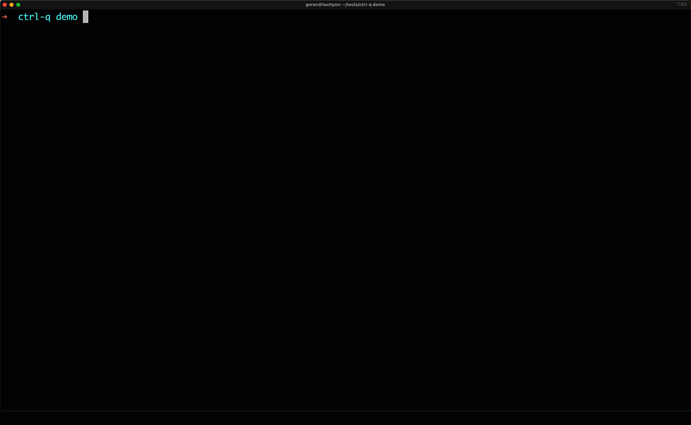
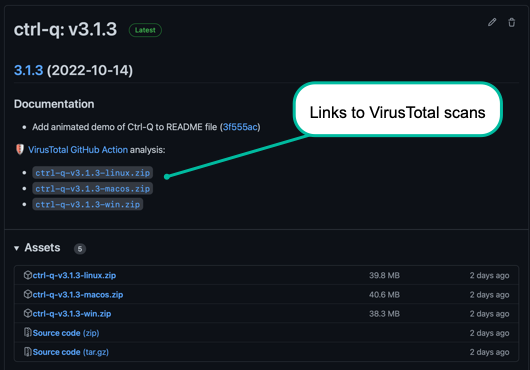
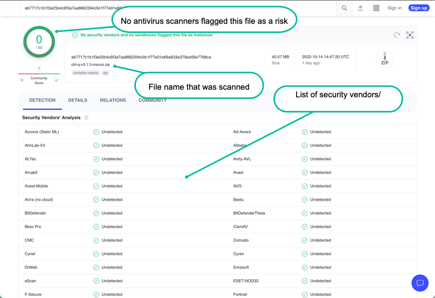
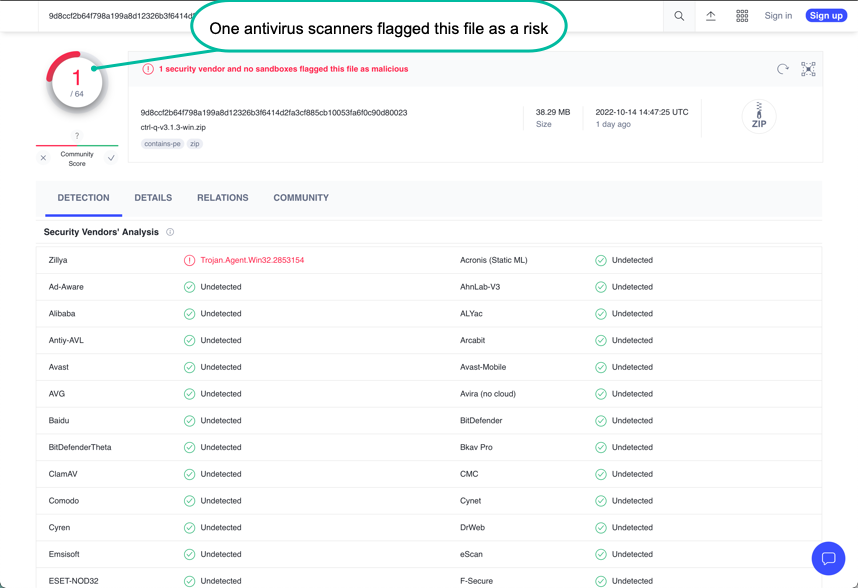

<p align="center"><p>

<h1 align="center">Ctrl-Q makes life easier for Qlik Sense admins and developers.<br><br>

It is a cross platform, command line tool for interacting with client-managed Qlik Sense Enterprise on Windows.</h2>

<p align="center">

</p>
<br>
<h2 align="center">Ctrl-Q is designed to be easily extensible if/when additional features are needed.<br>
It is open source with a permissive MIT license.<br>
</h2>
<p align="center">
<a href="https://github.com/ptarmiganlabs/ctrl-q"></a>
<a href="https://github.com/ptarmiganlabs/ctrl-q/actions/workflows/release-please.yml"></a>
<a href="https://github.com/ptarmiganlabs/ctrl-q/releases"></a>

</p>
<br>
<br>


The focus of Ctrl-Q is on slightly more complex use cases that are not handled out of the box by other tools such as [Qlik's official Qlik CLI tool](https://qlik.dev/libraries-and-tools/qlik-cli) or Adam Haydon's [Qlik CLI Windows](https://github.com/ahaydon/Qlik-Cli-Windows) tool.  
Both are exceptional tools and extremely useful, but especially when it comes to interactions with the Qlik Sense engine they fall a bit short.

Ctrl-Q also tries to fill niches that are not covered by the various members of the Butler family of open source SenseOps tools.

The Butler tools each focus on a specific feature (or features in the case of [the original Butler tool](https://github.com/ptarmiganlabs/butler)) and goes fairly deep in those areas.  
For example, [Butler SOS](https://github.com/ptarmiganlabs/butler-sos) focus on getting real-time metrics and events out of Sense and into a wide range of target databases and monitoring tools.  
[Butler Sheet Icons](https://github.com/ptarmiganlabs/butler-sheet-icons) creates sheet thumbnails for Sense apps - but offers lots of flexibility and power around that use case.

Ctrl-Q instead focus on specific, high-value uses cases that tend to be very time consuming and/or error prone to do manually.  

Automated creation of master items is an example.  
Manually creating hundreds of master items can take hours or days.  
Having the definitions in an Excel file and then using Ctrl-Q shorten that time to minutes - at least once that Excel file has been created.  
A bonus is that the process can be included in CI/CD pipelines, with increased reusability and app quality as a result.

Maybe Qlik's CLI tool will evolve to include more of these use cases and engine-focused features too - great if so.  
Until then Ctrl-Q can hopefully make life a bit easier for Sense developers and admins out there.

Enjoy!

# Contents

- [Contents](#contents)
- [Getting started](#getting-started)
- [Logging](#logging)
- [Security](#security)
  - [Virus scanning](#virus-scanning)
    - [Positive scan vs false positives](#positive-scan-vs-false-positives)
  - [Signed binaries](#signed-binaries)
- [Commands](#commands)
  - [Bookmarks](#bookmarks)
    - [List bookmarks](#list-bookmarks)
  - [Measures](#measures)
    - [List measures](#list-measures)
    - [Delete measures](#delete-measures)
  - [Dimensions](#dimensions)
    - [List dimensions](#list-dimensions)
    - [Delete dimensions](#delete-dimensions)
  - [Import](#import)
    - [Import master items from Excel file](#import-master-items-from-excel-file)
  - [Scramble](#scramble)
  - [Get script](#get-script)

# Getting started

There is no need to install Ctrl-Q. Just download and run.  
The GitHub [release page](https://github.com/ptarmiganlabs/ctrl-q/releases) has ready-to-run binaries for Windows and macOS

The macOS binary is security scanned and signed by Apple, using their standard notarization process.  
This means you won't get those annoying warnings when using the app.

# Logging

Logging is controlled by the --log-level option.

Valid values are (in order of increasing verbosity): error, warn, info, verbose, debug, silly.

Note: When using log level silly all websocket communication to/from the Sense server will be logged to the console. This means *lots* of log output.

# Security

Ctrl-Q is open source and you have access to all source code.  
It is **your own responsibility** to determine if Ctrl-Q is suitable for **your** use case.
The creators of Ctrl-Q, including Ptarmigan Labs, Göran Sander or any other contributor, can and must never be held liable to past or future security issues of Ctrl-Q.
If you have security concerns or ideas around Ctrl-Q, please get involved in the project and contribute to making it better!

    If you discover a serious bug with Ctrl-Q that may pose a security problem, please disclose it confidentially to security@ptarmiganlabs.com first, so it can be assessed and hopefully fixed prior to being exploited. Please do not raise GitHub issues for serious security-related doubts or problems.

Various steps are taken to ensure that Ctrl-Q is as secure as possible.  

does not contain harmful or malicious software, but no such steps are guaranteed to be 100% complete.
While these steps greatly improves security no such steps can give a 100% guarantee to catch all issues.
It is ultimately **you** as the user of Ctrl-Q that must decide whether the tool is safe to use **for your use case**.  

The information in this section intends to provide guidance in that decision process.

## Virus scanning

Every time a Ctrl-Q release is done the created binaries are sent to [VirusTotal](https://www.virustotal.com/) for scanning.  
VirusTotal acts as an aggregated virus scanner that sends the Ctrl-Q binaries to dozens of anti-virus scanners, including many of the major, established ones.  

Links to the VirusTotal scan report are included in each release notes, making it easy to check the status of each binary:



A VirusTotal scan that reports "no risks found" can look like this:



### Positive scan vs false positives

If one or more of the security vendors used by VirusTotal reports an issue you have to make a decision.  
Is it a real issue or a false positive?

You have to decide this yourself, but some general lines of thought can be:

    Is it a single vendor that reports the Ctrl-Q binary file to be a risk, or several vendors?
    If one vendor reports an issue and 60+ vendors don't, you might be looking at a false positive.

But again - at the end of the day it's **you** that must make that decision.

A scan where a single security vendor reports an issue can look like this:



## Signed binaries

The macOS version is signed and notarized by Apple's standard process.  
A warning may still be shown first time the app is started. This is expected and normal.

# Commands

List available commands using the --help option:

```
C:\tools\ctrl-q>ctrl-q.exe --help
Usage: ctrl-q [options] [command]

Ctrl-Q is a command line utility for interacting with client-managed Qlik Sense Enterprise on Windows servers.
Among other things the tool manipulates master items and scrambles in-app data.

Options:
  -V, --version                         output the version number
  -h, --help                            display help for command

Commands:
  master-item-import [options]          create master items based on definitions in a file on disk
  master-item-measure-get [options]     get info about one or more master measures
  master-item-measure-delete [options]  delete master measure(s)
  master-item-dim-get [options]         get info about one or more master dimensions
  master-item-dim-delete [options]      delete master dimension(s)
  field-scramble [options]              scramble one or more fields in an app. A new app with the scrambled data is created.
  script-get [options]                  get script from Qlik Sense app
  bookmark-get [options]                get info about one or more bookmarks
  help [command]                        display help for command

C:\tools\ctrl-q>
```

## Bookmarks

### List bookmarks

```
C:\tools\ctrl-q>ctrl-q.exe bookmark-get --host 192.168.100.109 --app-id a3e0f5d2-000a-464f-998d-33d333b175d7 --output-format table --auth-user-dir LAB --auth-user-id goran
2022-10-12T18:05:35.615Z info: Get bookmarks
2022-10-12T18:05:36.000Z info: Bookmarks
┌────────────────────────────────────────────────────────────────────────────────────────────────────────────────────────────────────────────────────────────────────────────────────────────────────────────────────────────────────────────────────────────────────────────────────────────────────────────────────┐
│                                                                                                                                      Bookmarks (1 bookmarks found in the app)                                                                                                                                      │
├──────────────────────────────────────┬──────────┬───────────┬─────────────────┬──────────────────────────────────────────────────────────────────────────────────────────────────────┬──────────┬───────────┬──────────────────────────┬──────────────────────────┬──────────────────────────┬─────────────────────┤
│ Id                                   │ Type     │ Title     │ Description     │ Bookmark definition                                                                                  │ Approved │ Published │ Publish time             │ Created date             │ Modified date            │ Owner               │
├──────────────────────────────────────┼──────────┼───────────┼─────────────────┼──────────────────────────────────────────────────────────────────────────────────────────────────────┼──────────┼───────────┼──────────────────────────┼──────────────────────────┼──────────────────────────┼─────────────────────┤
│ 81ec0c0d-c90c-431b-8c19-eff4048de404 │ bookmark │ Bookmark1 │ BM1 description │ {"qStateData":[{"qStateName":"$","qFieldItems":[{"qDef":{"qName":"Dim1","qType":"PRESENT"},"qSelectI │ false    │ false     │ 1753-01-01T00:00:00.000Z │ 2021-07-06T15:09:38.565Z │ 2021-07-06T15:09:38.565Z │ undefined\undefined │
│                                      │          │           │                 │ nfo":{"qRangeLo":"NaN","qRangeHi":"NaN","qNumberFormat":{"qType":"U","qnDec":10,"qUseThou":0},"qRang │          │           │                          │                          │                          │                     │
│                                      │          │           │                 │ eInfo":[],"qContinuousRangeInfo":[]},"qValues":[],"qExcludedValues":[]}]}],"qUtcModifyTime":44383.71 │          │           │                          │                          │                          │                     │
│                                      │          │           │                 │ 498842593,"qVariableItems":[],"qPatches":[]}                                                         │          │           │                          │                          │                          │                     │
└──────────────────────────────────────┴──────────┴───────────┴─────────────────┴──────────────────────────────────────────────────────────────────────────────────────────────────────┴──────────┴───────────┴──────────────────────────┴──────────────────────────┴──────────────────────────┴─────────────────────┘


C:\tools\ctrl-q>
```

## Measures

### List measures

```
C:\tools\ctrl-q>ctrl-q.exe master-item-measure-get --host 192.168.100.109 --app-id a3e0f5d2-000a-464f-998d-33d333b175d7 --output-format table --auth-user-dir LAB --auth-user-id goran
2022-10-12T19:47:37.416Z info: Get master measures
2022-10-12T19:47:37.893Z info:
┌───────────────────────────────────────────────────────────────────────────────────────────────────────────────────────────────────────────────────────────────────────────────────────────────────────────────────────────────────────────────────────────────────────────────────────────────────────────────────────────────────────────────────────────────────────────────────────────────────┐
│                                                                                                                                                                              Measures (6 measures found in the app)                                                                                                                                                                               │
├──────────────────────────────────────┬─────────┬────────────────────────┬───────────────────────────────────────────────────┬──────────────────┬──────────────────┬──────────────────────┬───────────┬───────────────────────────────────────┬──────────┬──────────┬───────────┬──────────────────────────┬──────────────────────────┬──────────────────────────┬─────────────────────┬───────────┤
│ Id                                   │ Type    │ Title                  │ Description                                       │ Label            │ Label expression │ Definition           │ Coloring  │ Number format                         │ Grouping │ Approved │ Published │ Publish time             │ Created date             │ Modified date            │ Owner               │ Tags      │
├──────────────────────────────────────┼─────────┼────────────────────────┼───────────────────────────────────────────────────┼──────────────────┼──────────────────┼──────────────────────┼───────────┼───────────────────────────────────────┼──────────┼──────────┼───────────┼──────────────────────────┼──────────────────────────┼──────────────────────────┼─────────────────────┼───────────┤
│ 04bf8dc9-a354-41f5-ad57-cb445c725479 │ measure │ Revenue EUR            │ Revenue during selected time period.              │ ='Revenue'       │ ='Revenue'       │ Sum(Revenue)         │ undefined │ {"qType":"U","qnDec":10,"qUseThou":0} │ N        │ false    │ false     │ 1753-01-01T00:00:00.000Z │ 2022-10-12T18:24:55.392Z │ 2022-10-12T18:24:55.392Z │ undefined\undefined │ Sales     │
├──────────────────────────────────────┼─────────┼────────────────────────┼───────────────────────────────────────────────────┼──────────────────┼──────────────────┼──────────────────────┼───────────┼───────────────────────────────────────┼──────────┼──────────┼───────────┼──────────────────────────┼──────────────────────────┼──────────────────────────┼─────────────────────┼───────────┤
│ 44a56d5b-1fe4-4e71-b3dd-5695275ce687 │ measure │ Profit EUR             │ Profit during selected time period.               │ ='Profit'        │ ='Profit'        │ Sum(Profit)          │ undefined │ {"qType":"U","qnDec":10,"qUseThou":0} │ N        │ false    │ false     │ 1753-01-01T00:00:00.000Z │ 2022-10-12T18:24:55.392Z │ 2022-10-12T18:24:55.392Z │ undefined\undefined │ Sales     │
├──────────────────────────────────────┼─────────┼────────────────────────┼───────────────────────────────────────────────────┼──────────────────┼──────────────────┼──────────────────────┼───────────┼───────────────────────────────────────┼──────────┼──────────┼───────────┼──────────────────────────┼──────────────────────────┼──────────────────────────┼─────────────────────┼───────────┤
│ 57b1e128-014a-42e4-991e-ab2cc9124b7a │ measure │ Revenue EUR (LY)       │ Revenue during last year.                         │ ='Revenue LY'    │ ='Revenue LY'    │ Sum(Revenue_LY)      │ undefined │ {"qType":"U","qnDec":10,"qUseThou":0} │ N        │ false    │ false     │ 1753-01-01T00:00:00.000Z │ 2022-10-12T18:24:55.392Z │ 2022-10-12T18:24:55.392Z │ undefined\undefined │ Sales, LY │
├──────────────────────────────────────┼─────────┼────────────────────────┼───────────────────────────────────────────────────┼──────────────────┼──────────────────┼──────────────────────┼───────────┼───────────────────────────────────────┼──────────┼──────────┼───────────┼──────────────────────────┼──────────────────────────┼──────────────────────────┼─────────────────────┼───────────┤
│ 81f92d37-b201-4752-9314-33af74a57d94 │ measure │ No. of sold units (LY) │ Number of units sold last year.                   │ ='Sold units LY' │ ='Sold units LY' │ Sum(UnitsInOrder_LY) │ undefined │ {"qType":"U","qnDec":10,"qUseThou":0} │ N        │ false    │ false     │ 1753-01-01T00:00:00.000Z │ 2022-10-12T18:24:55.392Z │ 2022-10-12T18:24:55.392Z │ undefined\undefined │ Sales, LY │
├──────────────────────────────────────┼─────────┼────────────────────────┼───────────────────────────────────────────────────┼──────────────────┼──────────────────┼──────────────────────┼───────────┼───────────────────────────────────────┼──────────┼──────────┼───────────┼──────────────────────────┼──────────────────────────┼──────────────────────────┼─────────────────────┼───────────┤
│ bcbed8aa-f76f-40ee-ba23-ae8a9a58f7c5 │ measure │ No. of sold units      │ Number of units sold during selected time period. │ ='Sold units'    │ ='Sold units'    │ =Sum(UnitsInOrder)   │ undefined │ {"qType":"U","qnDec":10,"qUseThou":0} │ N        │ false    │ false     │ 1753-01-01T00:00:00.000Z │ 2022-10-12T18:24:55.392Z │ 2022-10-12T18:24:55.392Z │ undefined\undefined │ Sales     │
├──────────────────────────────────────┼─────────┼────────────────────────┼───────────────────────────────────────────────────┼──────────────────┼──────────────────┼──────────────────────┼───────────┼───────────────────────────────────────┼──────────┼──────────┼───────────┼──────────────────────────┼──────────────────────────┼──────────────────────────┼─────────────────────┼───────────┤
│ c147058b-2ca9-4991-a44a-8656db3574c1 │ measure │ Profit EUR (LY)        │ Profit during last year                           │ ='Profit LY'     │ ='Profit LY'     │ Sum(Profit_LY)       │ undefined │ {"qType":"U","qnDec":10,"qUseThou":0} │ N        │ false    │ false     │ 1753-01-01T00:00:00.000Z │ 2022-10-12T18:24:55.392Z │ 2022-10-12T18:24:55.392Z │ undefined\undefined │ Sales, LY │
└──────────────────────────────────────┴─────────┴────────────────────────┴───────────────────────────────────────────────────┴──────────────────┴──────────────────┴──────────────────────┴───────────┴───────────────────────────────────────┴──────────┴──────────┴───────────┴──────────────────────────┴──────────────────────────┴──────────────────────────┴─────────────────────┴───────────┘


C:\tools\ctrl-q>
```

### Delete measures

```
C:\tools\ctrl-q>ctrl-q.exe master-item-measure-delete --host 192.168.100.109 --app-id a3e0f5d2-000a-464f-998d-33d333b175d7 --auth-user-dir LAB --auth-user-id goran --id-type id --master-item 44a56d5b-1fe4-4e71-b3dd-5695275ce687 c147058b-2ca9-4991-a44a-8656db3574c1
2022-10-12T19:48:42.395Z info: Delete master measures
2022-10-12T19:48:42.774Z info: Deleted master item measure "Profit EUR", id=44a56d5b-1fe4-4e71-b3dd-5695275ce687 in app "a3e0f5d2-000a-464f-998d-33d333b175d7"
2022-10-12T19:48:42.776Z info: Deleted master item measure "Profit EUR (LY)", id=c147058b-2ca9-4991-a44a-8656db3574c1 in app "a3e0f5d2-000a-464f-998d-33d333b175d7"

C:\tools\ctrl-q>
```

## Dimensions

### List dimensions

```
C:\tools\ctrl-q>ctrl-q.exe master-item-dim-get --host 192.168.100.109 --app-id a3e0f5d2-000a-464f-998d-33d333b175d7 --output-format table --auth-user-dir LAB --auth-user-id goran
2022-10-12T19:49:33.971Z info: Get master dimensions
2022-10-12T19:49:34.370Z info:
┌────────────────────────────────────────────────────────────────────────────────────────────────────────────────────────────────────────────────────────────────────────────────────────────────────────────────────────────────────────────────────────────────────────────────────────────────────────────────────────────────────────────────────────────────────────────────────────────────────────────────────────────────────────────────────────────┐
│                                                                                                                                                                                                         Dimensions (4 dimensions found in the app)                                                                                                                                                                                                         │
├──────────────────────────────────────┬───────────┬─────────────────┬────────────────────────────────┬───────────────────────────────┬────────────────────────┬──────────────────┬──────────────────┬─────────────┬───────────────────────────────────────────────────────────────────────────────┬──────────┬──────────┬───────────┬──────────────────────────┬──────────────────────────┬──────────────────────────┬─────────────────────┬────────────────┤
│ Id                                   │ Type      │ Title           │ Description (static)           │ Description (from expression) │ Description expression │ Label expression │ Definition count │ Definition  │ Coloring                                                                      │ Grouping │ Approved │ Published │ Publish time             │ Created date             │ Modified date            │ Owner               │ Tags           │
├──────────────────────────────────────┼───────────┼─────────────────┼────────────────────────────────┼───────────────────────────────┼────────────────────────┼──────────────────┼──────────────────┼─────────────┼───────────────────────────────────────────────────────────────────────────────┼──────────┼──────────┼───────────┼──────────────────────────┼──────────────────────────┼──────────────────────────┼─────────────────────┼────────────────┤
│ 41070084-7bd3-4dc6-95a6-44131114ed6a │ dimension │ Salesperson     │ The person who sold the unit.  │                               │                        │ ='Salesperson'   │ 1                │ Salesperson │ undefined                                                                     │ N        │ false    │ false     │ 1753-01-01T00:00:00.000Z │ 2022-10-12T18:24:55.392Z │ 2022-10-12T18:24:55.392Z │ undefined\undefined │ Staff, Sales   │
├──────────────────────────────────────┼───────────┼─────────────────┼────────────────────────────────┼───────────────────────────────┼────────────────────────┼──────────────────┼──────────────────┼─────────────┼───────────────────────────────────────────────────────────────────────────────┼──────────┼──────────┼───────────┼──────────────────────────┼──────────────────────────┼──────────────────────────┼─────────────────────┼────────────────┤
│ 85f05898-a483-4caa-8f90-011c6dc48c6b │ dimension │ Sales month     │ Date in which a unit was sold. │                               │                        │ ='Sales month'   │ 1                │ Month_Sales │ undefined                                                                     │ N        │ false    │ false     │ 1753-01-01T00:00:00.000Z │ 2022-10-12T18:24:55.392Z │ 2022-10-12T18:24:55.392Z │ undefined\undefined │ Sales calendar │
├──────────────────────────────────────┼───────────┼─────────────────┼────────────────────────────────┼───────────────────────────────┼────────────────────────┼──────────────────┼──────────────────┼─────────────┼───────────────────────────────────────────────────────────────────────────────┼──────────┼──────────┼───────────┼──────────────────────────┼──────────────────────────┼──────────────────────────┼─────────────────────┼────────────────┤
│ 866fc972-76fb-49c4-bceb-2db959d1d59e │ dimension │ Country         │ Country where a unit was sold. │                               │                        │ ='Country'       │ 1                │ Country     │ undefined                                                                     │ N        │ false    │ false     │ 1753-01-01T00:00:00.000Z │ 2022-10-12T18:24:55.392Z │ 2022-10-12T18:24:55.392Z │ undefined\undefined │ Geo            │
├──────────────────────────────────────┼───────────┼─────────────────┼────────────────────────────────┼───────────────────────────────┼────────────────────────┼──────────────────┼──────────────────┼─────────────┼───────────────────────────────────────────────────────────────────────────────┼──────────┼──────────┼───────────┼──────────────────────────┼──────────────────────────┼──────────────────────────┼─────────────────────┼────────────────┤
│ JDWuPK                               │ dimension │ Dimension 2-3-1 │ Description for 2-3-1          │                               │                        │                  │ 3                │ Dim2        │ {"changeHash":"0.5399463179200534","baseColor":{"color":"#ffffff","index":1}} │ H        │ false    │ false     │ 1753-01-01T00:00:00.000Z │ 2021-06-07T02:31:02.093Z │ 2021-06-07T02:31:02.093Z │ undefined\undefined │ My awesome tag │
│                                      │           │                 │                                │                               │                        │                  │                  │ Dim3        │                                                                               │          │          │           │                          │                          │                          │                     │                │
│                                      │           │                 │                                │                               │                        │                  │                  │ Dim1        │                                                                               │          │          │           │                          │                          │                          │                     │                │
└──────────────────────────────────────┴───────────┴─────────────────┴────────────────────────────────┴───────────────────────────────┴────────────────────────┴──────────────────┴──────────────────┴─────────────┴───────────────────────────────────────────────────────────────────────────────┴──────────┴──────────┴───────────┴──────────────────────────┴──────────────────────────┴──────────────────────────┴─────────────────────┴────────────────┘


C:\tools\ctrl-q>
```

### Delete dimensions

```
C:\tools\ctrl-q>ctrl-q.exe master-item-dim-delete --host 192.168.100.109 --app-id a3e0f5d2-000a-464f-998d-33d333b175d7 --auth-user-dir LAB --auth-user-id goran --id-type id --master-item 41070084-7bd3-4dc6-95a6-44131114ed6a 85f05898-a483-4caa-8f90-011c6dc48c6b
2022-10-12T19:50:34.097Z info: Delete master dimensions
2022-10-12T19:50:34.475Z info: Deleted master item dimension "Salesperson", id=41070084-7bd3-4dc6-95a6-44131114ed6a in app "a3e0f5d2-000a-464f-998d-33d333b175d7"
2022-10-12T19:50:34.476Z info: Deleted master item dimension "Sales month", id=85f05898-a483-4caa-8f90-011c6dc48c6b in app "a3e0f5d2-000a-464f-998d-33d333b175d7"

C:\tools\ctrl-q>
```

## Import

### Import master items from Excel file

This command imports dimensions and measures into master items in a Sense app.

First let's take a look at the command options:

```
C:\tools\ctrl-q>ctrl-q.exe master-item-import --help
Usage: ctrl-q master-item-import [options]

create master items based on definitions in a file on disk

Options:
  --log-level <level>                                log level (choices: "error", "warn", "info", "verbose", "debug", "silly", default: "info")
  --host <host>                                      Qlik Sense server IP/FQDN
  --port <port>                                      Qlik Sense server engine port (default: "4747")
  --schema-version <string>                          Qlik Sense engine schema version (default: "12.612.0")
  --app-id <id>                                      Qlik Sense app ID
  --virtual-proxy <prefix>                           Qlik Sense virtual proxy prefix (default: "")
  --secure <true|false>                              connection to Qlik Sense engine is via https (default: true)
  --auth-user-dir <directory>                        user directory for user to connect with
  --auth-user-id <userid>                            user ID for user to connect with
  -a, --auth-type <type>                             authentication type (choices: "cert", default: "cert")
  --auth-cert-file <file>                            Qlik Sense certificate file (exported from QMC) (default: "./cert/client.pem")
  --auth-cert-key-file <file>                        Qlik Sense certificate key file (exported from QMC) (default: "./cert/client_key.pem")
  --auth-root-cert-file <file>                       Qlik Sense root certificate file (exported from QMC) (default: "./cert/root.pem")
  -t, --file-type <type>                             source file type (choices: "excel", default: "excel")
  --file <filename>                                  file containing master item definitions
  --sheet <name>                                     name of Excel sheet where dim/measure flag column is found
  --col-ref-by <reftype>                             how to refer to columns in the source file. Options are by name or by position (zero based) (choices: "name", "position", default: "name")
  --col-item-type <column position or name>          column where dim/measure flag is found. Use "dim" in that column to create master dimension, "measure" for master measure
  --col-master-item-name <column position or name>   column number (zero based) to use as master item name
  --col-master-item-descr <column position or name>  column number (zero based) to use as master item description
  --col-master-item-label <column position or name>  column number (zero based) to use as master item label
  --col-master-item-expr <column position or name>   column number (zero based) to use as master item expression
  --col-master-item-tag <column position or name>    column number (zero based) to use as master item tags
  --limit-import-count <number>                      import at most x number of master items from the Excel file. Defaults to 0 = no limit (default: 0)
  -h, --help                                         display help for command

C:\tools\ctrl-q>
```

```
C:\tools\ctrl-q>ctrl-q.exe master-item-import --host 192.168.100.109 --app-id a3e0f5d2-000a-464f-998d-33d333b175d7 --auth-user-dir LAB --auth-user-id goran --auth-type cert --file-type excel --file ./ctrl-q-testdata.xlsx --sheet Sales --col-ref-by name --col-item-type "Master item type" --col-master-item-name "Master Item Name" --col-master-item-descr "Description" --col-master-item-label "Label" --col-master-item-expr "Expression" --col-master-item-tag "Tag"
2022-10-12T18:24:54.320Z info: Import master items from definitions in Excel file "./ctrl-q-testdata.xlsx"
2022-10-12T18:24:54.753Z warn: Found an unknown master item type: "Master item type". Ignoring this line in the imported file.
2022-10-12T18:24:54.794Z info: Created new measure "No. of sold units"
2022-10-12T18:24:54.839Z info: Created new measure "No. of sold units (LY)"
2022-10-12T18:24:54.877Z info: Created new measure "Revenue EUR"
2022-10-12T18:24:54.922Z info: Created new measure "Revenue EUR (LY)"
2022-10-12T18:24:54.962Z info: Created new measure "Profit EUR"
2022-10-12T18:24:54.962Z warn: Found an unknown master item type: "measur". Ignoring this line in the imported file.
2022-10-12T18:24:55.002Z info: Created new measure "Profit EUR (LY)"
2022-10-12T18:24:55.039Z info: Created new dimension "Country"
2022-10-12T18:24:55.089Z info: Created new dimension "Sales month"
2022-10-12T18:24:55.137Z info: Created new dimension "Salesperson"

C:\tools\ctrl-q>
```

## Scramble

Scrambles one or more fields in an app using Qlik Sense's internal scrambling feature.  

Note:  

- If more than one field is to be scrambled, the indidivudal field names should be separated by the character or string specified in the `--separator` option. 
- The entire list of field names (the `--fieldname` option) should be surrounded by double quotes.
- A new app with the scrambled data will be created. Specify its name in the `--newappname` option.

```
C:\tools\ctrl-q>ctrl-q.exe field-scramble --host 192.168.100.109 --app-id a3e0f5d2-000a-464f-998d-33d333b175d7 --auth-user-dir LAB --auth-user-id goran --field-name Expression1 Dim1 AsciiAlpha --new-app-name __ScrambledTest1
2022-10-12T20:12:36.002Z info: Scramble field
2022-10-12T20:12:36.742Z info: Scrambled field "Expression1"
2022-10-12T20:12:36.748Z info: Scrambled field "Dim1"
2022-10-12T20:12:36.753Z info: Scrambled field "AsciiAlpha"
2022-10-12T20:12:38.015Z info: Scrambled data written to new app "__ScrambledTest1" with app ID: 016573df-cd8c-43e9-a448-535698b440f0

C:\tools\ctrl-q>
```

## Get script

Get script and associated metadata for a Sense app

```
C:\tools\ctrl-q>ctrl-q.exe script-get --host 192.168.100.109 --app-id a3e0f5d2-000a-464f-998d-33d333b175d7 --auth-user-dir LAB --auth-user-id goran
2022-10-12T20:13:37.771Z info: ----- Script metadata -----
2022-10-12T20:13:37.772Z info: App id: a3e0f5d2-000a-464f-998d-33d333b175d7
2022-10-12T20:13:37.778Z info: Created date: 2021-06-03T22:04:52.283Z
2022-10-12T20:13:37.779Z info: Modified date: 2021-06-04T15:42:23.759Z
2022-10-12T20:13:37.780Z info: ----- End script metadata -----
2022-10-12T20:13:37.782Z info:
///$tab Main
SET ThousandSep=',';
SET DecimalSep='.';
SET MoneyThousandSep=',';
SET MoneyDecimalSep='.';
SET MoneyFormat='$#,##0.00;-$#,##0.00';
SET TimeFormat='h:mm:ss TT';
SET DateFormat='M/D/YYYY';
SET TimestampFormat='M/D/YYYY h:mm:ss[.fff] TT';
SET FirstWeekDay=6;
SET BrokenWeeks=1;
SET ReferenceDay=0;
SET FirstMonthOfYear=1;
SET CollationLocale='en-US';
SET CreateSearchIndexOnReload=1;
SET MonthNames='Jan;Feb;Mar;Apr;May;Jun;Jul;Aug;Sep;Oct;Nov;Dec';
SET LongMonthNames='January;February;March;April;May;June;July;August;September;October;November;December';
SET DayNames='Mon;Tue;Wed;Thu;Fri;Sat;Sun';
SET LongDayNames='Monday;Tuesday;Wednesday;Thursday;Friday;Saturday;Sunday';
SET NumericalAbbreviation='3:k;6:M;9:G;12:T;15:P;18:E;21:Z;24:Y;-3:m;-6:μ;-9:n;-12:p;-15:f;-18:a;-21:z;-24:y';

Characters:
Load Chr(RecNo()+Ord('A')-1) as Alpha, RecNo() as Num autogenerate 26;

ASCII:
Load
 if(RecNo()>=65 and RecNo()<=90,RecNo()-64) as Num,
 Chr(RecNo()) as AsciiAlpha,
 RecNo() as AsciiNum
autogenerate 255
 Where (RecNo()>=32 and RecNo()<=126) or RecNo()>=160 ;

Transactions:
Load
 TransLineID,
 TransID,
 mod(TransID,26)+1 as Num,
 Pick(Ceil(3*Rand1),'A','B','C') as Dim1,
 Pick(Ceil(6*Rand1),'a','b','c','d','e','f') as Dim2,
 Pick(Ceil(3*Rand()),'X','Y','Z') as Dim3,
 Round(1000*Rand()*Rand()*Rand1) as Expression1,
 Round(  10*Rand()*Rand()*Rand1) as Expression2,
 Round(Rand()*Rand1,0.00001) as Expression3;
Load
 Rand() as Rand1,
 IterNo() as TransLineID,
 RecNo() as TransID
Autogenerate 1000
 While Rand()<=0.5 or IterNo()=1;

 Comment Field Dim1 With "This is a field comment";

C:\tools\ctrl-q>
```
