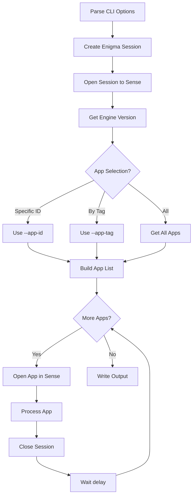

# qseow app-metadata-get

> Extract comprehensive metadata from Qlik Sense apps

## Overview

The `app-metadata-get` command retrieves and exports detailed metadata from one or more Qlik Sense applications. It extracts various components of an app including load scripts, sheets, stories, master objects, dimensions, measures, bookmarks, variables, fields, data connections, and table/key information from the data model.

This command is useful for:

- Auditing app contents and structure
- Analyzing data lineage and field usage
- Documenting app configurations
- Creating inventory of Qlik Sense assets

## Basic Syntax

```bash
ctrl-q qseow app-metadata-get --host <server> --auth-user-dir <dir> --auth-user-id <user> [options]
```

## Required Options

| Option                     | Description                           |
| -------------------------- | ------------------------------------- |
| `--host <host>`            | Qlik Sense server hostname or IP      |
| `--auth-user-dir <dir>`    | User directory for authentication     |
| `--auth-user-id <user>`    | User ID for authentication            |
| `--virtual-proxy <prefix>` | Virtual proxy prefix (default: empty) |
| `--secure <true\|false>`   | Use secure connection (default: true) |

## Authentication

The command supports two authentication methods:

### Certificate Authentication (Default)

```bash
--auth-type cert
--auth-cert-file ./cert/client.pem
--auth-cert-key-file ./cert/client_key.pem
--auth-root-cert-file ./cert/root.pem
```

### JWT Authentication

```bash
--auth-type jwt
--auth-jwt <jwt-token>
```

## App Selection

Choose which apps to process:

### By Specific App ID

```bash
--app-id 79f610f2-2164-43d3-be66-0eaacf13f143
```

### By Tag

```bash
--app-tag Sales
--app-tag Finance
```

### All Apps (Default)

When neither `--app-id` nor `--app-tag` is specified, all apps on the server are processed.

## Data Loading Options

| Option                      | Default | Description                                          |
| --------------------------- | ------- | ---------------------------------------------------- |
| `--open-without-data true`  | true    | Open app without loading data (faster)               |
| `--open-without-data false` | -       | Open app WITH data loaded (required for tables/keys) |

**Important**: Set `--open-without-data false` to extract table and key information from the data model.

```bash
--open-without-data false
```

## Output Options

### Output Format

| Option                 | Description          |
| ---------------------- | -------------------- |
| `--output-format json` | JSON files (default) |
| `--output-format qvd`  | QVD files            |

### Output Destination

| Option                 | Description              |
| ---------------------- | ------------------------ |
| `--output-dest file`   | Write to files (default) |
| `--output-dest screen` | Print to console         |

### Output Detail

| Option                    | Description      |
| ------------------------- | ---------------- |
| `--output-detail summary` | Counts only      |
| `--output-detail full`    | Full metadata    |
| `--output-detail both`    | Summary and full |

### Output Count

| Option                    | Description                |
| ------------------------- | -------------------------- |
| `--output-count single`   | One combined file          |
| `--output-count multiple` | One file per app (default) |

## Intel Files

Intel files contain structured extraction of labels, expressions, field names, and other meaningful content from the app. This is useful for impact analysis and documentation.

| Option                      | Default            | Description               |
| --------------------------- | ------------------ | ------------------------- |
| `--create-intel-file true`  | true               | Create intel files        |
| `--create-intel-file false` | -                  | Skip intel extraction     |
| `--intel-file-name <name>`  | app-metadata-intel | Base name for intel files |

## Timing Options

| Option                      | Default | Description                                      |
| --------------------------- | ------- | ------------------------------------------------ |
| `--sleep-between-apps 1000` | 1000ms  | Delay between apps when processing multiple apps |

Increase this value if you encounter "App already open" errors when processing multiple apps.

## Limit Options

| Option                | Default      | Description                       |
| --------------------- | ------------ | --------------------------------- |
| `--limit-app-count 0` | 0 (no limit) | Maximum number of apps to process |

## Code Flow



## Output Structure

### JSON Output Files

When `--output-count multiple`:

```

app-metadata*<appName>.json
app-metadata-intel*<appName>.json

```

When `--output-count single`:

```

app-metadata.json
app-metadata-intel.json

```

### QVD Output Files

For each app, these columns are created:

| Column          | Description                          |
| --------------- | ------------------------------------ |
| app_id          | App GUID                             |
| app_name        | App name                             |
| script          | Load script (stringified JSON)       |
| properties      | App properties (stringified JSON)    |
| sheets          | Sheet objects (stringified JSON)     |
| stories         | Story objects (stringified JSON)     |
| masterobjects   | Master objects (stringified JSON)    |
| dimensions      | Master dimensions (stringified JSON) |
| measures        | Master measures (stringified JSON)   |
| bookmarks       | Bookmarks (stringified JSON)         |
| variables       | Variables (stringified JSON)         |
| fields          | Field definitions (stringified JSON) |
| dataconnections | Data connections (stringified JSON)  |
| tables          | Table/key info (stringified JSON)    |

### Intel File Structure

Intel files contain analyzed content from the app:

```json
{
  "intel": {
    "extractedAt": "2026-04-12T08:00:00.000Z",
    "appId": "79f610f2-...",
    "appName": "Sales App",
    "extractors": ["sheet", "dimension", "measure", ...],
    "count": 150,
    "items": [
      {
        "value": "Sales Amount",
        "type": "title",
        "sourceType": "sheet",
        "sourceId": "sheet-1",
        "sourceName": "Sales Overview",
        "path": "sheets[0].qProperty.qMetaDef.title"
      },
      ...
    ]
  }
}
```

## Metadata Sections

The following sections are extracted from each app:

### Script Section

- `loadScript` - The Qlik load script

### Properties Section

- `properties` - App-level properties and metadata

### Visualization Objects

- `sheets` - All sheets
- `stories` - All stories
- `masterobjects` - Master objects

### Master Items

- `dimensions` - Master dimensions
- `measures` - Master measures

### Other Objects

- `bookmarks` - Bookmarks
- `variables` - Variables (script, reserved, config)
- `fields` - Field definitions
- `dataconnections` - Data connections

### Data Model (when --open-without-data false)

- `tables` - Table information from the data model:
    - `qtr` - Array of tables with fields
    - `qk` - Array of keys linking tables

## Usage Examples

### Basic App Metadata Export

```bash
ctrl-q qseow app-metadata-get \
  --host sense-server.example.com \
  --auth-user-dir MYDIR \
  --auth-user-id goran \
  --app-id 79f610f2-2164-43d3-be66-0eaacf13f143 \
  --output-dir ./output
```

### Export Multiple Apps by Tag

```bash
ctrl-q qseow app-metadata-get \
  --host sense-server.example.com \
  --auth-user-dir MYDIR \
  --auth-user-id goran \
  --app-tag Production \
  --output-format json
```

### Extract with Data Model (Tables/Keys)

```bash
ctrl-q qseow app-metadata-get \
  --host sense-server.example.com \
  --auth-user-dir MYDIR \
  --auth-user-id goran \
  --app-id 79f610f2-2164-43d3-be66-0eaacf13f143 \
  --open-without-data false \
  --output-detail full
```

### Output to Console

```bash
ctrl-q qseow app-metadata-get \
  --host sense-server.example.com \
  --auth-user-dir MYDIR \
  --auth-user-id goran \
  --app-id 79f610f2-2164-43d3-be66-0eaacf13f143 \
  --output-dest screen \
  --output-detail summary
```

### Export to QVD Format

```bash
ctrl-q qseow app-metadata-get \
  --host sense-server.example.com \
  --auth-user-dir MYDIR \
  --auth-user-id goran \
  --app-id 79f610f2-2164-43d3-be66-0eaacf13f143 \
  --output-format qvd \
  --output-count multiple
```

## Environment Variables

All options can be set via environment variables:

| CLI Option             | Environment Variable     |
| ---------------------- | ------------------------ |
| `--log-level`          | CTRLQ_LOG_LEVEL          |
| `--host`               | CTRLQ_HOST               |
| `--port`               | CTRLQ_ENGINE_PORT        |
| `--schema-version`     | CTRLQ_SCHEMA_VERSION     |
| `--app-id`             | CTRLQ_APP_ID             |
| `--app-tag`            | CTRLQ_APP_TAG            |
| `--open-without-data`  | CTRLQ_OPEN_WITHOUT_DATA  |
| `--auth-type`          | CTRLQ_AUTH_TYPE          |
| `--output-format`      | CTRLQ_OUTPUT_FORMAT      |
| `--output-count`       | CTRLQ_OUTPUT_COUNT       |
| `--output-dest`        | CTRLQ_OUTPUT_DEST        |
| `--output-detail`      | CTRLQ_OUTPUT_DETAIL      |
| `--create-intel-file`  | CTRLQ_CREATE_INTEL_FILE  |
| `--output-file-name`   | CTRLQ_OUTPUT_FILE_NAME   |
| `--intel-file-name`    | CTRLQ_INTEL_FILE_NAME    |
| `--limit-app-count`    | CTRLQ_LIMIT_APP_COUNT    |
| `--output-dir`         | CTRLQ_OUTPUT_DIR         |
| `--sleep-between-apps` | CTRLQ_SLEEP_BETWEEN_APPS |

## Error Handling

### Common Errors

#### "App already open in different mode"

This occurs when an app is already open in another session, or when the server hasn't fully released a previous session.

**Solutions**:

1. Wait for any other sessions to finish
2. Increase `--sleep-between-apps` value (e.g., 2000)
3. Ensure no other processes are accessing the app

#### "Invalid method parameter(s)"

This may occur when the schema version doesn't support certain parameters. Try updating the schema version or simplifying the call.

#### Authentication Errors

- Verify certificate files exist and are valid
- For JWT auth, ensure token hasn't expired
- Check that the user has appropriate permissions

## See Also

- [Command Index](./index.md)
- [Qlik Sense Engine API](https://help.qlik.com/en-US/sense-developer/November2025/Subsystems/EngineJSONAPI/Content/EngineJSONAPI.html)
