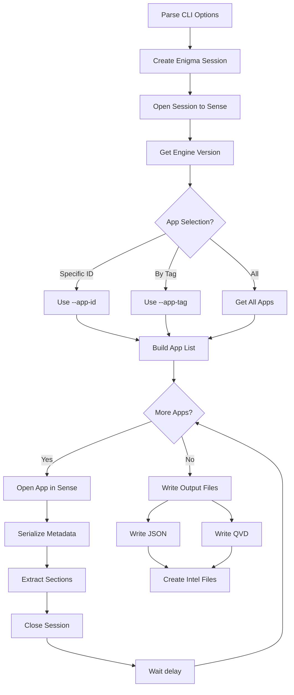

# qseow app-metadata-get

> Extract comprehensive metadata from Qlik Sense apps

## Overview

The `app-metadata-get` command retrieves and exports detailed metadata from one or more Qlik Sense applications. It extracts load scripts, sheets, stories, master objects, dimensions, measures, bookmarks, variables, fields, data connections, and table/key information.

## Usage

```bash
ctrl-q qseow app-metadata-get --host <server> --auth-user-dir <dir> --auth-user-id <user>
```

## Required Options

- `--host <host>` - Qlik Sense server hostname or IP
- `--auth-user-dir <dir>` - User directory for authentication
- `--auth-user-id <user>` - User ID for authentication
- `--virtual-proxy <prefix>` - Virtual proxy prefix (default: empty)
- `--secure <true|false>` - Use secure connection (default: true)

## Authentication

### Certificate (Default)

```bash
--auth-type cert
--auth-cert-file ./cert/client.pem
--auth-cert-key-file ./cert/client_key.pem
--auth-root-cert-file ./cert/root.pem
```

### JWT

```bash
--auth-type jwt
--auth-jwt <jwt-token>
```

## App Selection

- By ID: `--app-id <id>`
- By tag: `--app-tag <tag>` (can repeat)
- All apps: (default when neither specified)

## Data Loading

- `--open-without-data true` (default) - Open without data (faster)
- `--open-without-data false` - Open WITH data (required for tables/keys)

> **Note**: When using default (`--open-without-data true`), the following sections will be empty:
>
> - `fields` - Field definitions from the data model
> - `tables` - Table and key information
>
> This is intentional. Opening apps with data is a heavy operation that can severely impact performance in large QSEoW environments with thousands of apps. Getting fields and tables data requires actually loading the app's data model into memory.
>
> Field names are implicitly available via the load script (in the `script` section), except for any binary loads.
>
> To get fields and tables data, use `--open-without-data false`.

## Output Options

### Format

- `--output-format json` (default)
- `--output-format qvd`

### Destination

- `--output-dest file` (default)
- `--output-dest screen`

### Detail

- `--output-detail summary` - Counts only
- `--output-detail full` - Full metadata
- `--output-detail both` - Both

### File Count

- `--output-count single` - One combined file
- `--output-count multiple` (default) - One file per app

## Intel Files

- `--create-intel-file true` (default) - Create intel files
- `--intel-file-name <name>` - Base name (default: app-metadata-intel)

## Timing

- `--sleep-between-apps 1000` - Delay between apps in ms (default: 1000)

## Limit

- `--limit-app-count 0` - Max apps to process (default: 0 = no limit)

## Code Flow



## Output Columns (QVD format)

- app_id - App GUID
- app_name - App name
- script - Load script
- properties - App properties
- sheets - Sheet objects
- stories - Story objects
- masterobjects - Master objects
- dimensions - Master dimensions
- measures - Master measures
- bookmarks - Bookmarks
- variables - Variables
- fields - Field definitions
- dataconnections - Data connections
- tables - Table/key info

## Metadata Sections

- loadScript - Qlik load script
- properties - App-level properties
- sheets - All sheets
- stories - All stories
- masterobjects - Master objects
- dimensions - Master dimensions
- measures - Master measures
- bookmarks - Bookmarks
- variables - Variables
- fields - Field definitions
- dataconnections - Data connections
- tables - Table information (when --open-without-data false)

## Examples

### Basic Export

```bash
ctrl-q qseow app-metadata-get \
  --host sense-server.example.com \
  --auth-user-dir MYDIR \
  --auth-user-id goran \
  --app-id 79f610f2-2164-43d3-be66-0eaacf13f143 \
  --output-dir ./output
```

### Extract Tables/Keys

```bash
ctrl-q qseow app-metadata-get \
  --host sense-server.example.com \
  --auth-user-dir MYDIR \
  --auth-user-id goran \
  --app-id 79f610f2-2164-43d3-be66-0eaacf13f143 \
  --open-without-data false
```

### Output to Console

```bash
ctrl-q qseow app-metadata-get \
  --host sense-server.example.com \
  --auth-user-dir MYDIR \
  --auth-user-id goran \
  --app-id 79f610f2-2164-43d3-be66-0eaacf13f143 \
  --output-dest screen \
  --output-detail summary
```

## Environment Variables

| Option               | Variable                 |
| -------------------- | ------------------------ |
| --log-level          | CTRLQ_LOG_LEVEL          |
| --host               | CTRLQ_HOST               |
| --app-id             | CTRLQ_APP_ID             |
| --app-tag            | CTRLQ_APP_TAG            |
| --open-without-data  | CTRLQ_OPEN_WITHOUT_DATA  |
| --output-format      | CTRLQ_OUTPUT_FORMAT      |
| --output-count       | CTRLQ_OUTPUT_COUNT       |
| --output-dest        | CTRLQ_OUTPUT_DEST        |
| --output-detail      | CTRLQ_OUTPUT_DETAIL      |
| --create-intel-file  | CTRLQ_CREATE_INTEL_FILE  |
| --output-dir         | CTRLQ_OUTPUT_DIR         |
| --sleep-between-apps | CTRLQ_SLEEP_BETWEEN_APPS |

## Errors

### "App already open in different mode"

Solutions:

1. Wait for other sessions to finish
2. Increase --sleep-between-apps value
3. Ensure no other processes access the app

## See Also

- [Command Index](../index.md)
- [Qlik Sense Engine API](https://help.qlik.com)
